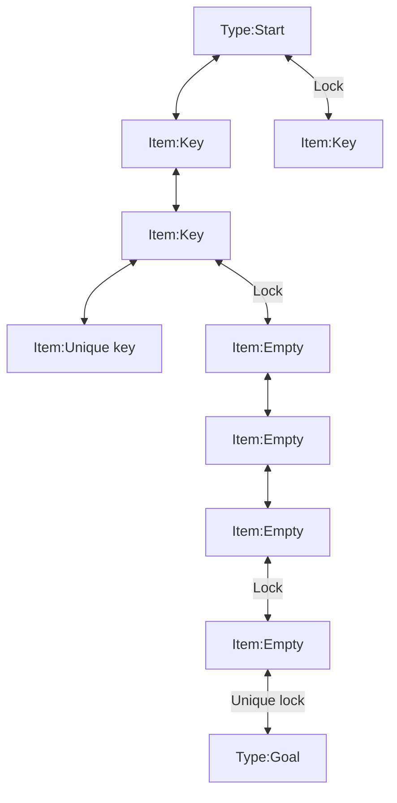

# Apply MissionGraph

This page explains how to use MissionGraph to add a **progression route where the player finds keys and unlocks doors** while moving through the dungeon.

MissionGraph is currently a beta feature.  
It is easier to work with after your normal dungeon generation setup is already stable.

## Goal
- Understand what MissionGraph adds to dungeon generation
- Confirm the basic flow of locked doors and key placement
- Understand the roles of `DungeonDoor` and `DungeonRoomSensor`

## What to Know First
- MissionGraph adds a **start-to-goal progression route** to the dungeon
- Locked doors and key placement are realized by actors that use the MissionGraph information
- For the first test, keep it simple and only verify the flow of `pick up a key -> open a door -> move forward`

## Prerequisites
- [QuickStart.en.md](./QuickStart.en.md) is complete
- Normal dungeon generation already works
- You understand the basic settings in [UDungeonGenerateParameter.en.md](./UDungeonGenerateParameter.en.md)
- You are ready to add both door actors and room sensors

## What MissionGraph Does
When MissionGraph is enabled, dungeon generation builds a progression flow like this.

- The player starts from a start room
- A key is found in a room along the route
- A locked door is opened to reach a new area
- If needed, a `Unique key` opens the final special door
- The player eventually reaches the goal

In other words, MissionGraph does more than place rooms.  
It adds **an intended order of progression** to the dungeon.

## Fastest Setup
Start with the minimum setup and confirm that MissionGraph is actually affecting the dungeon.

### 1. Enable MissionGraph in `Generate parameter`
In `UDungeonGenerateParameter`, check the following.

- `UseMissionGraph = true`
- `MergeRooms = false`
- `AisleComplexity = 0`

When you use MissionGraph, it is safer and easier to understand if you do not combine it with room merging or normal aisle-complexity routing.

### 2. Prepare a Door Actor
The door actor handles the look and behavior of locked doors.  
Create a Blueprint door derived from `DungeonDoorBase`, then register it in `Door Parts` so generation can use it.

### 3. Prepare Key Spawning on the Room Sensor Side
Keys and unique keys are handled on the room side using MissionGraph data.  
If you are using a Blueprint derived from `ADungeonRoomSensorBase`, set `SpawnKeyActor` and `SpawnUniqueKeyActor` as needed.

### 4. Generate the Dungeon and Check the Progression
After generation, confirm that the following flow exists.

- The player can move through the start area
- A key can be picked up along the route
- That key opens a corresponding door
- The player can eventually reach the goal

## Role of Each Piece
MissionGraph data is mainly consumed by the following two actor types.

### `DungeonDoor`
- Receives lock information and behaves as a door
- Acts as the entry point that distinguishes normal doors from locked doors

### `DungeonRoomSensor`
- Handles the actors and events needed in each room
- Can also be used to place keys and unique keys

## How to Read the Graph
The diagram below is an example of a progression structure generated by MissionGraph.

- Arrows are aisles
- An arrow labeled `Lock` is a locked door
- `Unique lock` is a door that can be opened only by the unique key in that dungeon
- Squares are rooms
- `Item: Key` and `Item: Unique key` show what item is placed in the room

## Verify the Result
- Some areas are inaccessible before picking up a key
- Picking up a key allows the matching door to open
- The final `Unique key` and final door work correctly
- The full progression from start to goal is valid

## Common Mistakes
- `UseMissionGraph` is enabled, but it still feels like a normal dungeon  
  First, focus only on locked doors and key placement so the MissionGraph effect is obvious
- `MergeRooms` or `AisleComplexity` conflicts with the intended setup  
  Use `MergeRooms = false` and `AisleComplexity = 0` as the baseline for MissionGraph
- Doors appear, but keys do not  
  Recheck the `DungeonRoomSensor` setup, especially `SpawnKeyActor` and `SpawnUniqueKeyActor`
- Keys appear, but the door behavior or visuals do not match  
  Recheck the door actor registered in `Door Parts`

## Read Next
- [UDungeonGenerateParameter.en.md](./UDungeonGenerateParameter.en.md)
- [ADungeonRoomSensorBase.en.md](./ADungeonRoomSensorBase.en.md)
- [FDungeonDoorActorParts.en.md](./FDungeonDoorActorParts.en.md)
