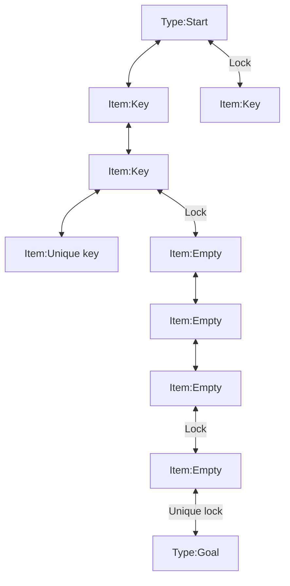

# ミッショングラフを適用する

このページでは、**鍵を手に入れて扉を開けながら進む攻略ルート** を  
MissionGraph でダンジョンに適用する流れを説明します。

MissionGraph はベータ版の機能です。  
通常のダンジョン生成が安定してから試すと、設定の切り分けがしやすくなります。

## このページのゴール
- MissionGraph が何を追加する機能か理解する
- 鍵付き扉と鍵配置の基本的な流れを確認できる
- `DungeonDoor` と `DungeonRoomSensor` の役割を理解できる

## 先に知っておくこと
- MissionGraph は、**スタートからゴールまでの攻略手順** をダンジョンに与える仕組みです
- 鍵付き扉や鍵の配置そのものは、MissionGraph の情報をもとに各アクターが実現します
- 最初は複雑な演出を増やさず、`鍵を取る -> 扉を開ける -> 先へ進む` の流れだけ確認するのがおすすめです

## 前提
- [QuickStart.ja.md](./QuickStart.ja.md) が完了している
- 通常のダンジョン生成が成功している
- [UDungeonGenerateParameter.ja.md](./UDungeonGenerateParameter.ja.md) の基本設定を理解している
- ドア用アクターと部屋センサーを追加できる状態になっている

## MissionGraph を使うと何が起こるか
MissionGraph を有効にすると、ダンジョン生成時に次のような攻略フローが作られます。

- スタート部屋から探索を始める
- 途中の部屋で鍵を見つける
- 鍵付き扉を開けて新しいエリアへ進む
- 必要に応じて `Unique key` で最後の扉を開ける
- 最終的にゴールへ到達する

つまり、MissionGraph はただ部屋を並べるだけでなく、  
**どの順番で攻略するか** をダンジョンへ与える機能です。

## 最短手順
まずは、最小構成で MissionGraph が働いていることを確認します。

### 1. `Generate parameter` で MissionGraph を有効にする
`UDungeonGenerateParameter` で次の点を確認してください。

- `UseMissionGraph = true`
- `MergeRooms = false`
- `AisleComplexity = 0`

MissionGraph を使うときは、`MergeRooms` と通常の通路複雑化設定を一緒に使わない方が分かりやすく、安全です。

### 2. ドア用アクターを用意する
鍵付き扉の見た目や挙動は、ドア用アクターが担当します。  
`DungeonDoorBase` を継承した Blueprint ドアを用意し、  
`Door Parts` に登録して生成で使えるようにします。

### 3. 部屋センサー側で鍵スポーンを用意する
鍵や特別な鍵は、MissionGraph の情報をもとに部屋側で扱います。  
`ADungeonRoomSensorBase` を継承した Blueprint を使う場合は、  
必要に応じて `SpawnKeyActor` と `SpawnUniqueKeyActor` を設定してください。

### 4. ダンジョンを生成して攻略順を確認する
生成後は、次の流れが成立しているかを確認します。

- スタートから進める範囲がある
- 途中で鍵を入手できる
- その鍵で開けられる扉がある
- 最後にゴールへ到達できる

## 各要素の役割
MissionGraph の情報は、主に次の 2 種類のアクターに渡されます。

### `DungeonDoor`
- 必要な錠前情報を受け取って、扉として振る舞います
- 通常の扉なのか、鍵付き扉なのかを区別する入口になります

### `DungeonRoomSensor`
- その部屋に必要なアクターやイベントを扱います
- 鍵や特別な鍵を置く役割も、ここから実現できます

## グラフの見方
下の図は、MissionGraph が生成した攻略構造の例です。

- 矢印は通路です
- `Lock` が付いた矢印は鍵付き扉です
- `Unique lock` は、そのダンジョンで唯一の鍵だけで開く扉です
- 四角は部屋です
- `Item: Key` や `Item: Unique key` は、その部屋に置かれるアイテムを表します

## 確認する
- 鍵のない状態では先へ進めない場所がある
- 鍵を取ると対応する扉を開けられる
- `Unique key` を使う最後の扉が機能している
- ゴールまでの攻略順が成立している

## よくある失敗
- `UseMissionGraph` を有効にしたが、通常ダンジョンとの違いが分からない  
  まずは鍵付き扉と鍵配置だけに絞って確認してください
- `MergeRooms` や `AisleComplexity` の設定が競合している  
  MissionGraph を使うときは `MergeRooms = false`、`AisleComplexity = 0` を基準にしてください
- 扉は出るが鍵が出ない  
  `DungeonRoomSensor` 側の設定、特に `SpawnKeyActor` / `SpawnUniqueKeyActor` を見直してください
- 鍵は出るが扉の見た目や挙動が合わない  
  `Door Parts` に登録しているドア用アクターを見直してください

## 次に読む
- [UDungeonGenerateParameter.ja.md](./UDungeonGenerateParameter.ja.md)
- [ADungeonRoomSensorBase.ja.md](./ADungeonRoomSensorBase.ja.md)
- [FDungeonDoorActorParts.ja.md](./FDungeonDoorActorParts.ja.md)
