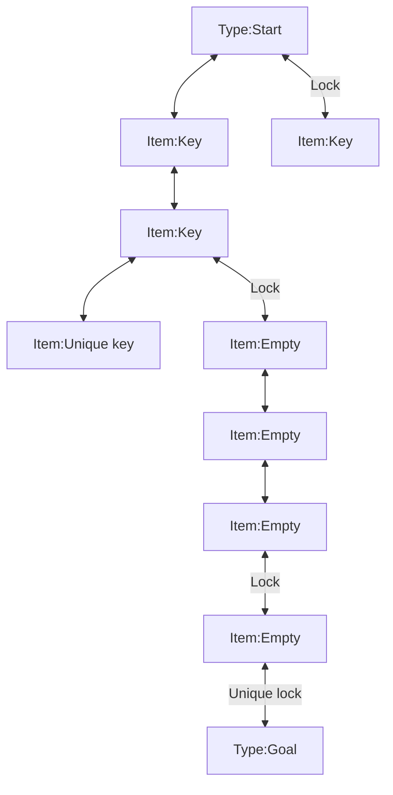

# MissionGraph を適用する

このページでは、ダンジョン内を進みながら **鍵を見つけて扉を開ける進行ルート** を MissionGraph で追加する方法を説明します。

MissionGraph は現在ベータ版の機能です。  
通常のダンジョン生成設定が安定してから試すと、設定の切り分けがしやすくなります。

## このページのゴール
- MissionGraph がダンジョン生成に何を追加するのかを理解する
- 鍵付き扉と鍵配置の基本的な流れを確認する
- `DungeonDoor` と `DungeonRoomSensor` の役割を理解する

## 先に知っておくこと
- MissionGraph は、ダンジョンに **スタートからゴールまでの進行ルート** を追加します
- 鍵付き扉と鍵の配置は、MissionGraph の情報を使うアクターによって実現されます
- 最初のテストでは複雑な演出を増やさず、`鍵を拾う -> 扉を開ける -> 先へ進む` という流れだけを確認するのがおすすめです

## 前提条件
- [QuickStart.ja.md](./QuickStart.ja.md) が完了している
- 通常のダンジョン生成が動作している
- [UDungeonGenerateParameter.ja.md](./UDungeonGenerateParameter.ja.md) の基本設定を理解している
- 扉アクターと部屋センサーの両方を追加できる状態になっている

## MissionGraph が行うこと
`Path.ProgressionPolicy = KeysAndLocks` にすると、ダンジョン生成時に次のような進行フローが作られます。

- プレイヤーはスタート部屋から始まる
- ルート上の部屋で通常の鍵を見つける
- 通常の鍵付き扉を開けると、通常の鍵を 1 つ消費する
- `Unique key` は、ゴール部屋へ続く最後の特別な扉を開ける
- 最終的にプレイヤーはゴールへ到達する

つまり、MissionGraph は単に部屋を配置するだけではありません。  
ダンジョンに **意図された攻略順序** を追加する機能です。  
また、必要な鍵付き扉を迂回してゴールへ到達できないように、生成時にルートの妥当性も検証されます。

## 最短セットアップ
まずは最小構成で、MissionGraph が実際にダンジョンへ影響していることを確認します。

### 1. `Generate parameter` で MissionGraph を有効にする
`UDungeonGenerateParameter` で次の項目を確認してください。

- `Path.ProgressionPolicy = KeysAndLocks`
- `Path.ExtraCorridorComplexity = 0`

MissionGraph を使う場合、鍵付き扉の進行を迂回できないように、安全ではないルートの複雑化は無視されます。  
ループは、鍵と扉の順序を壊さない場合にのみ現れることがあります。

### 2. 扉アクターを用意する
扉アクターは、鍵付き扉の見た目と挙動を担当します。  
`DungeonDoorBase` を継承した Blueprint 扉を作成し、生成時に使えるように `Door Parts` へ登録します。

### 3. 部屋センサー側で鍵のスポーンを用意する
鍵とユニーク鍵は、MissionGraph の情報を使って部屋側で扱います。  
`ADungeonRoomSensorBase` を継承した Blueprint を使っている場合は、必要に応じて `SpawnKeyActor` と `SpawnUniqueKeyActor` を設定してください。

### 4. ダンジョンを生成して進行を確認する
生成後、次の流れが成立しているか確認します。

- プレイヤーがスタート周辺を移動できる
- ルート上で鍵を拾える
- その鍵で対応する扉を開けられる
- 最終的にゴールへ到達できる

## 各要素の役割
MissionGraph の情報は、主に次の 2 種類のアクターで利用されます。

### `DungeonDoor`
- 鍵情報を受け取り、扉として振る舞う
- 通常の扉と鍵付き扉を区別する入口になる

### `DungeonRoomSensor`
- 各部屋で必要なアクターやイベントを扱う
- 鍵やユニーク鍵の配置にも利用できる

## グラフの読み方
下の図は、MissionGraph によって生成された進行構造の例です。

- 矢印は通路です
- `Lock` と書かれた矢印は鍵付き扉です
- `Unique lock` は、そのダンジョン内のユニーク鍵だけで開けられる扉です
- 四角は部屋です
- `Item: Key` と `Item: Unique key` は、その部屋に配置されるアイテムを表します

```mermaid
graph TB;
	0_18_2["Item:Unique key"]
	15_22_1["Type:Start"]
	9_20_1["Item:Key"]
	27_5_1["Type:Goal"]
	8_26_1["Item:Key"]
	22_24_1["Item:Key"]
	10_13_1["Item:Empty"]
	15_15_1["Item:Empty"]
	15_7_0["Item:Empty"]
	20_0_1["Item:Empty"]

	15_22_1<-->|"Lock"|22_24_1;
	15_22_1<-->8_26_1;
	8_26_1<-->9_20_1;
	9_20_1<-->0_18_2;
	9_20_1<-->|"Lock"|10_13_1;
	10_13_1<-->15_15_1;
	15_15_1<-->15_7_0;
	15_7_0<-->|"Lock"|20_0_1;
	20_0_1<-->|"Unique lock"|27_5_1;
```

## 結果を確認する
- 鍵を拾う前は進めない場所がある
- 通常の鍵を拾うと通常の鍵付き扉を 1 つ開けられ、その鍵は消費される
- 最後の `Unique key` と最後の扉が正しく動作する
- ゴール部屋を開ける前に通常の鍵が使い切られる
- スタートからゴールまでの進行ルートが成立している

## よくある失敗
- `Path.ProgressionPolicy = KeysAndLocks` にしたが、通常のダンジョンとの違いが分かりにくい  
  まずは鍵付き扉と鍵配置だけに絞って、MissionGraph の効果が分かりやすい状態で確認してください
- `Path.ExtraCorridorComplexity` が意図したセットアップと競合している  
  MissionGraph では `Path.ExtraCorridorComplexity = 0` を基準にしてください
- 扉は出るが、鍵が出ない  
  `DungeonRoomSensor` 側の設定、特に `SpawnKeyActor` と `SpawnUniqueKeyActor` を見直してください
- 鍵は出るが、扉の見た目や挙動が合わない  
  `Door Parts` に登録している扉アクターを見直してください

## 次に読む
- [UDungeonGenerateParameter.ja.md](./UDungeonGenerateParameter.ja.md)
- [ADungeonRoomSensorBase.ja.md](./ADungeonRoomSensorBase.ja.md)
- [FDungeonDoorActorParts.ja.md](./FDungeonDoorActorParts.ja.md)
