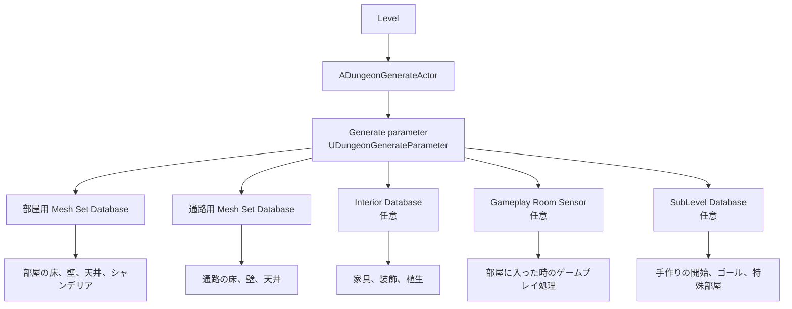

# Dungeon Generator チュートリアル索引

このディレクトリには、初めてプラグインを触る方向けの手順書と、アセット/クラスごとの参照ページをまとめています。
非エンジニアや Unreal Engine 初心者の方は、まず「最初に読む」の順番で進めてください。

自前のメッシュで見た目を作りたい場合は、`QuickStart` の次に **メッシュパーツの準備ページ** から読むと流れをつかみやすくなります。

## 基本データの関係
最初に作ることが多いアセットと、どこへ割り当てるかの関係です。

## 最初に読む
1. [QuickStart.ja.md](./QuickStart.ja.md)
   最短でダンジョンを 1 つ生成する手順です。
2. [ADungeonGenerateActor.ja.md](./ADungeonGenerateActor.ja.md)
   レベルに配置して使う生成アクターの役割と設定項目です。
3. [UDungeonGenerateParameter.ja.md](./UDungeonGenerateParameter.ja.md)
   マップ形状、開始位置、各種データベース指定をまとめて調整する中心アセットです。

## 見た目を整える
- [PrepareMeshParts.ja.md](./PrepareMeshParts.ja.md)
  自前メッシュを使い始めるための入口です。床 / 壁 / 屋根 / スロープの最低限の作り方、向き、原点、確認ポイントを初心者向けに説明します。
- [StaticMeshFitTool.ja.md](./StaticMeshFitTool.ja.md)
  選択した Static Mesh が Dungeon Generator のグリッド寸法に合うか確認し、補正済みコピーを生成する手順です。
- [UDungeonMeshSetDatabase.ja.md](./UDungeonMeshSetDatabase.ja.md)
  床・壁・天井・シャンデリアなど、見た目のテーマをまとめて管理します。
- [FDungeonMeshParts.ja.md](./FDungeonMeshParts.ja.md)
  単体メッシュの登録方法です。
- [FDungeonRandomActorParts.ja.md](./FDungeonRandomActorParts.ja.md)
  確率付きでアクターを置くパーツです。
- [FDungeonDoorActorParts.ja.md](./FDungeonDoorActorParts.ja.md)
  ドア用アクターパーツです。

## 特殊部屋と演出を追加する
- [ADungeonSubLevelScriptActor.ja.md](./ADungeonSubLevelScriptActor.ja.md)
  特別な部屋用サブレベルを作るためのレベルスクリプト親クラスです。
- [UDungeonSubLevelDatabase.ja.md](./UDungeonSubLevelDatabase.ja.md)
  スタート部屋、ゴール部屋、ランダム特殊部屋を登録します。
- [ADungeonRoomSensorBase.ja.md](./ADungeonRoomSensorBase.ja.md)
  部屋侵入イベント、トラップ、BGM 切り替えなどの基底クラスです。
  どの部屋にどのセンサーを置くかを管理します。
- [UDungeonInteriorDatabase.ja.md](./UDungeonInteriorDatabase.ja.md)
  タグを使って家具、装飾、植生を配置します。

## 応用
- [LoadReduction.ja.md](./LoadReduction.ja.md)
  `ADungeonMainLevelScriptActor` と `UDungeonComponentActivatorComponent` を使い、遠くの Actor、ライト、AI、collision、Tick の負荷を抑えて大きなランタイムダンジョンを快適にします。
- [GenerateMinimapTexture.ja.md](./GenerateMinimapTexture.ja.md)
  生成したダンジョンからミニマップを作り、テクスチャ保存や Widget 表示へつなげるガイドです。
- [ApplyMissionGraph.ja.md](./ApplyMissionGraph.ja.md)
  鍵付き扉と鍵配置を使った攻略ルートを MissionGraph で構成するガイドです。
- [CustomSelector.ja.md](./CustomSelector.ja.md)
  selector asset を使ってメッシュセットや各パーツの選択ルールを差し替えます。
- [LobbyConnection.ja.md](./LobbyConnection.ja.md)
  既存ロビーや開始部屋サブレベルとダンジョンを接続する手順です。

## 最低限必要なアセット
- `Generate parameter` アセット
- `Mesh set database` アセット 2 つ
  1 つは部屋用、もう 1 つは通路用として使うのが基本です。
- 生成結果を確認するためのレベル
  エディタの `Window > DungeonGenerator` でプレビューするか、`ADungeonGenerateActor` をレベルに配置します。

## よくある詰まり方
- 部屋用または通路用の `Mesh set database` が未設定
- `Mesh set database` に床 / 壁 / 天井メッシュが 1 つも入っていない
- サブレベルの `GridSize` が `UDungeonGenerateParameter` の `Theme.HorizontalGridSize` / `Theme.VerticalGridSize` と一致していない
- データベースを編集したのに `Build` を実行していない

## 次に読む
- [QuickStart.ja.md](./QuickStart.ja.md)
  最短手順でダンジョンを 1 つ生成したい場合の入口です。
- [PrepareMeshParts.ja.md](./PrepareMeshParts.ja.md)
  自前の床 / 壁 / 屋根 / スロープを作り始めたい場合の入口です。
- [StaticMeshFitTool.ja.md](./StaticMeshFitTool.ja.md)
  作成済み Static Mesh のサイズ確認や、グリッドに合わせたコピー生成を行いたい場合はこちらです。
- [ADungeonGenerateActor.ja.md](./ADungeonGenerateActor.ja.md)
  レベルに組み込んでゲーム中に生成したい場合はこちらです。
- [LoadReduction.ja.md](./LoadReduction.ja.md)
  敵、ライト、装飾、コリジョンの多いランタイムダンジョンを快適にしたい場合はこちらです。
- [UDungeonGenerateParameter.ja.md](./UDungeonGenerateParameter.ja.md)
  Generate parameter で何を設定するかをまとめて確認できます。

