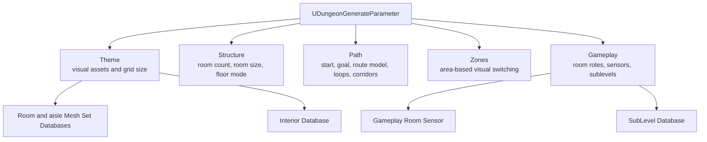
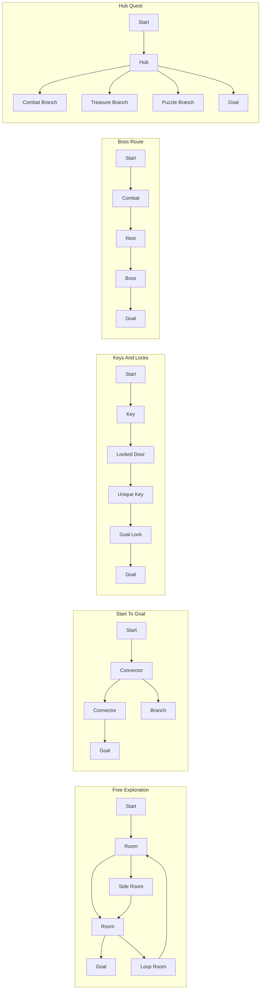
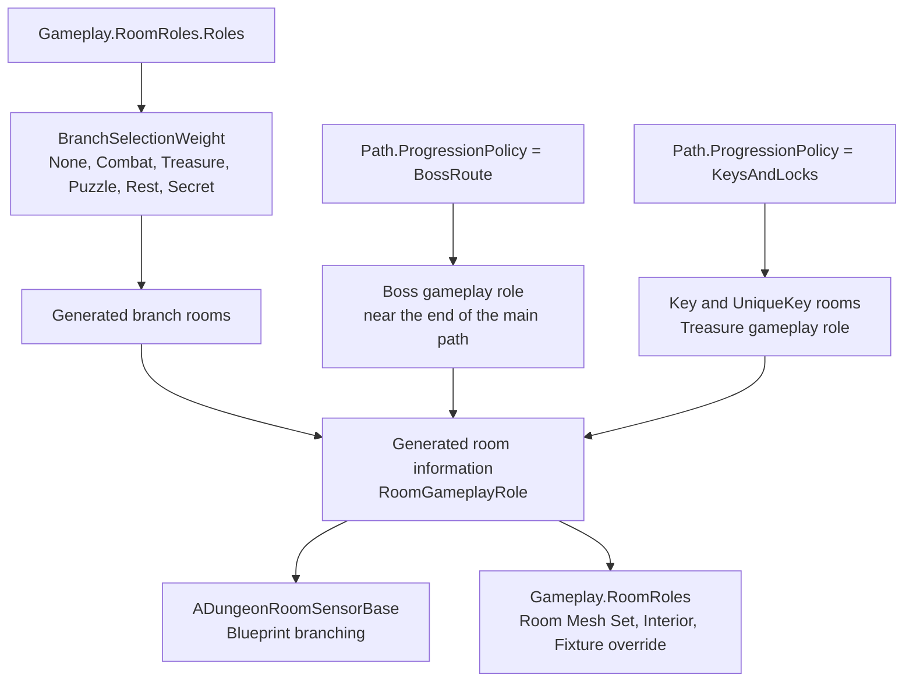
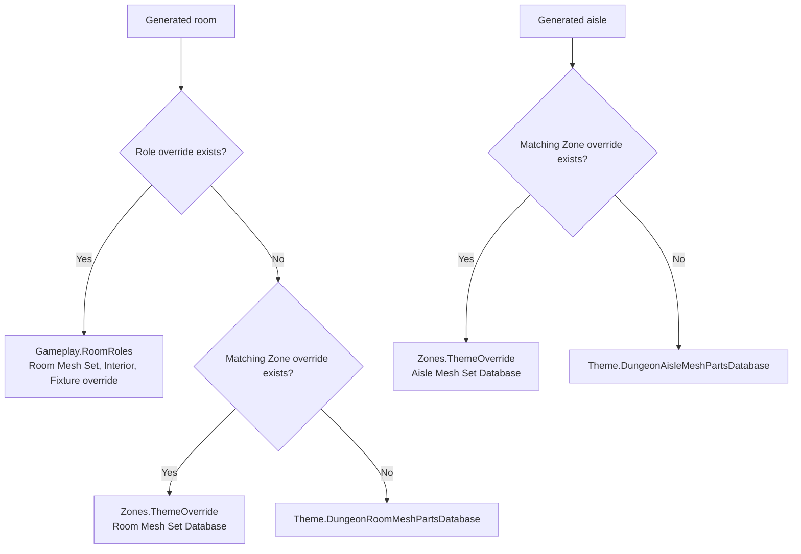
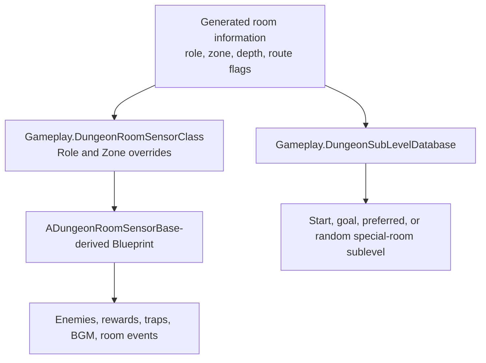

# UDungeonGenerateParameter Guide

`UDungeonGenerateParameter` is the central settings asset for dungeon generation.
In v2.0, it is easiest to think about it as three groups: layout, Zone-based theme switching, and generated room information passed to user gameplay logic.

## Main data groups
In v2.0, many settings that used to be top-level v1 fields are grouped by purpose.

## Configure these first
- `Theme.DungeonRoomMeshPartsDatabase`
  Mesh Set Database for room floors, walls, ceilings, chandeliers, and similar visuals.
- `Theme.DungeonAisleMeshPartsDatabase`
  Mesh Set Database for aisle floors, walls, ceilings, and similar visuals.
- `Theme.HorizontalGridSize` / `Theme.VerticalGridSize`
  Base grid size used to align meshes, sublevels, and generated rooms.
- `RandomSeed`
  `0` means random every time. A fixed value is useful when checking the same result repeatedly.

## Layout settings
- `Structure.RoomCountRange`
  Target room count. Set Min and Max to the same value when you want a fixed room count.
- `Structure.RoomWidth` / `RoomDepth` / `RoomHeight`
  Generated room size. Larger values feel more like halls; smaller values feel more maze-like.
- `Structure.HorizontalRoomMargin` / `VerticalRoomMargin`
  Spacing between rooms.
- `Structure.FloorMode`
  `Free` allows rooms to spread horizontally and vertically, `Flat` keeps every room on one floor height, and `Vertical` favors upward and downward layouts.

## Path
`Path` contains start and goal selection, the progression model, loop routing, and corridor settings.

- `Path.StartRoomPolicy` / `Path.GoalRoomPolicy`
  How the start and goal rooms are selected.
- `Path.ProgressionPolicy`
  Chooses the progression model, such as a normal route, key-and-lock route, or boss route.

  | Policy | Use it when you want |
  | --- | --- |
  | `FreeExploration` | Open exploration with loops, shortcuts, and optional side rooms. |
  | `StartToGoal` | A readable main route from the start room to the goal room. |
  | `KeysAndLocks` | A guaranteed solvable route where keys unlock required doors and unsafe bypass loops are disabled. |
  | `BossRoute` | A route that builds toward a boss or final encounter near the goal. |
  | `HubQuest` | A hub-centered layout where the player can branch out to quest-like rooms. |

In the image, `S` marks the start, `G` marks the goal, and the bright line shows a representative progression route. `Free Exploration` emphasizes loops and shortcuts, `Start To Goal` a readable main route, `Keys And Locks` the order of collecting a Key before passing a Lock, `Boss Route` a Boss near the end, and `Hub Quest` branches spreading from a central Hub. This is a conceptual illustration of the differences between Policies; it does not prescribe the exact room shapes or decoration that will be generated.

  Choose `Path.ProgressionPolicy` first. It is the main control for the route archetype, while `Path.MainRouteBias`, `Path.LoopRouteDensity`, and `Path.ExtraCorridorComplexity` are advanced fine-tuning controls inside the selected style.
  When migrating from v1 settings, `UseMissionGraph = true` maps to `Path.ProgressionPolicy = KeysAndLocks`. Normal v1 assets without MissionGraph migrate to `StartToGoal`.
- `Path.LayoutCandidateCount`
  Controls how many layout candidates are generated and compared before the best candidate is selected.
  Higher values make it easier to choose a better layout, but they also increase generation cost. Start with `3`, use `4-8` for a balance of quality and cost, and use `9-16` mainly for editor previews or fixed-seed tuning.
  Internally, `1` and `2` are still treated as at least `3` candidates. Values above `8` can become expensive for runtime generation.
- `Path.MainRouteBias`
  Advanced tuning for main-route emphasis. `0` uses the selected progression style baseline. Negative values nudge the layout toward more branch rooms. Positive values nudge it toward a longer main route with fewer branch rooms.
- `Path.LoopRouteDensity`
  Advanced tuning for loop routing and alternate routes. `0` uses the selected progression style baseline. Higher values add more loops where the policy allows them. `KeysAndLocks` progression disables unsafe loops so the player cannot bypass locked doors. In `StartToGoal`, `BossRoute`, and `HubQuest`, loops can connect intermediate rooms, but the goal room remains a single endpoint. `FreeExploration` can also connect loops near the goal.
- `Path.ExtraCorridorComplexity`
  Advanced tuning that adds extra corridor complexity after the progression route network is built. `0` adds no extra corridor complexity beyond the selected policy baseline. `KeysAndLocks` progression ignores this value and behaves as `0` to keep the key-and-lock route solvable.
- `Path.CorridorCeilingHeightPolicy`
  Selects aisle ceiling height from `1 Grid`, `2 Grids`, and `Random`. This affects both the look and the vertical space available for aisle-side decoration.

## Gameplay.RoomRoles
`Gameplay.RoomRoles.Roles` controls which gameplay role is more likely to be assigned to generated branch rooms, and can also override room visuals, interiors, and fixtures for each gameplay role.
Available branch gameplay roles are `None`, `Combat`, `Treasure`, `Puzzle`, `Rest`, and `Secret`.

| Role | Typical use |
| --- | --- |
| `None` | A normal room with no special gameplay meaning. |
| `Combat` | Enemy encounters or combat-focused room events. |
| `Treasure` | Rewards, loot, keys, or other pickups. Key and unique-key rooms in `KeysAndLocks` progression are treated as `Treasure`. |
| `Puzzle` | Switches, mechanisms, riddles, or interaction challenges. |
| `Rest` | Safe or lower-pressure rooms between stronger encounters. |
| `Boss` | A major encounter, usually assigned by `BossRoute` near the end of the main path. |
| `Secret` | Hidden discoveries, optional rewards, or secret events. |

The image illustrates how each Role can be used in a game. `None` is a normal room without a special purpose, `Combat` an encounter, `Treasure` a reward or key, `Puzzle` a mechanism or challenge, `Rest` a break, `Boss` a major encounter, and `Secret` hidden content. Assigning a Role does not automatically place the pictured enemies, treasure chests, or puzzles. Use the generated Role in Room Sensor Blueprint logic and Role-specific Theme Overrides to build the actual gameplay and visuals.

`Start`, `Goal`, `Hub`, `Connector`, `Branch`, and `DeadEnd` are structural roles controlled by route logic. `BossRoute` assigns the `Boss` gameplay role near the end of the main path. `HubQuest` marks an early main-path room as a structural `Hub`. A `Boss` profile can still provide role-specific room mesh overrides.

To create more secret rooms, increase `BranchSelectionWeight` on the `Secret` profile. There is no separate setting just for secret-room probability.

Role theme priority for room visuals is `Gameplay.RoomRoles` -> `Zones` -> `Theme`. Role overrides apply to generated rooms. Aisle meshes, aisle interiors, and slope interiors use `Zones` -> `Theme`.

## Zones
`Zones` switches Theme data by progress and floor range.

- `Zones[].Name`
  Zone name. This is also passed to generated room information.
- `Zones[].ProgressRange`
  Progress range from the start room.
- `Zones[].FloorRange`
  Floor range where the Zone applies.
- `Zones[].SelectionWeight`
  Relative weight used when more than one Zone matches the same progress and floor. A value of `0` prevents that Zone from being selected.
- `Zones[].ThemeOverride`
  Optional room and aisle Mesh Set Databases, Interior Database, and Fixtures used only in that Zone. Enable the explicit override flags when you want an empty value to intentionally disable inherited interiors or fixtures.
- `Zones[].GameplayOverride`
  Optional Room Sensor class and aisle actor overrides used only in that Zone.

If multiple Zones overlap, only Zones whose `ProgressRange` and `FloorRange` both match are included in the random draw. Non-overlapping Zones behave like direct range switches.

Theme priority is simple: a matching room role override is used first for room meshes, interiors, and fixtures, then the matching Zone override, then the standard settings in `Theme`. Aisles and slopes use the Zone override or the standard settings in `Theme`.

## Gameplay
`Gameplay` only keeps references needed after generation.

- `Gameplay.DungeonRoomSensorClass`
  Default `ADungeonRoomSensorBase`-derived Blueprint used in generated rooms. `Gameplay.RoomRoles.Roles[].GameplayOverride` has first priority, then `Zones[].GameplayOverride`, then this default.
- `Gameplay.SpawnActorInAisle`
  Default actor Blueprint candidates spawned inside generated aisles. `Zones[].GameplayOverride.SpawnActorInAisle` replaces this list for matching aisle Zones.
- `Gameplay.DungeonSubLevelDatabase`
  Registers sublevels for start rooms, goal rooms, and special rooms.

Enemies, rewards, traps, and other gameplay content are not placed directly by a reward category in this parameter. Implement them in `ADungeonRoomSensorBase` using generated room information such as `bSecretRoom`, `bDeadEndRoom`, `bMainPathRoom`, `bLockedRouteRoom`, `ZoneName`, and `DepthFromStartRatio`.

For quick tests, assign a Room Sensor Blueprint through `Gameplay.DungeonRoomSensorClass` and start with the `ADungeonRoomSensorBase` `DungeonGenerator|Helper` parameters before adding detailed Blueprint branching.

## Theme
- `Theme.DungeonInteriorDatabase`
  Database that places furniture, decoration, vegetation, and other props by tag.
- `Theme.Fixtures`
  Candidates and selection rules for pillars, torches, doors, and Unique Lock doors. `UniqueDoorParts` is mainly used for goal or boss doors created by Keys And Locks progression, and falls back to `DoorParts` when left empty.
- `Theme.Fixtures.*PartsSelector`
  Selector objects used when choosing fixture candidates such as pillars, torches, doors, and Unique Lock doors.
- `Theme.bDeferredVegetationSpawn`
  Spawns vegetation over multiple frames to reduce Play start stalls. Use the related `Theme|VegetationPerformance` settings to tune per-frame spawn and tree-build budgets. For runtime actor, light, AI, collision, and Tick control, see [LoadReduction.en.md](./LoadReduction.en.md).

## Recommended workflow
First stabilize generation with `Structure`, `Path`, and `Theme`.
Then use `Gameplay.RoomRoles` to tune branch-room roles and role-specific room visuals, interiors, fixtures, or sensors, `Zones` to switch visuals and aisle actors by area, and `Gameplay.DungeonRoomSensorClass` plus `ADungeonRoomSensorBase` to implement enemies, rewards, traps, and room-specific events.

## Related Pages
- [UDungeonMeshSetDatabase.en.md](./UDungeonMeshSetDatabase.en.md)
- [UDungeonSubLevelDatabase.en.md](./UDungeonSubLevelDatabase.en.md)
- [ADungeonRoomSensorBase.en.md](./ADungeonRoomSensorBase.en.md)
