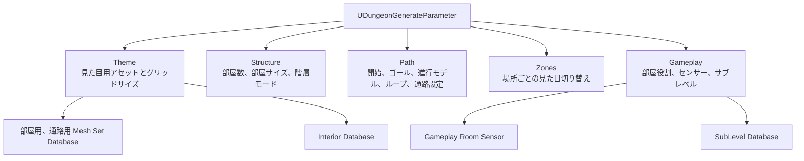
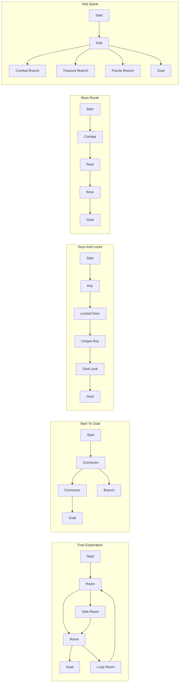
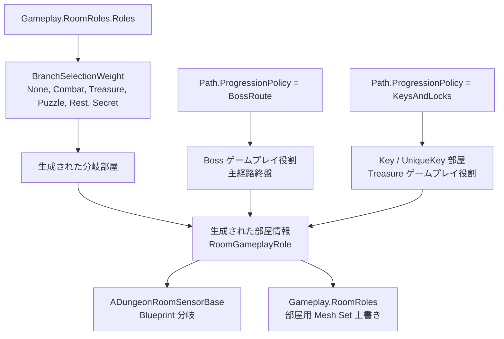
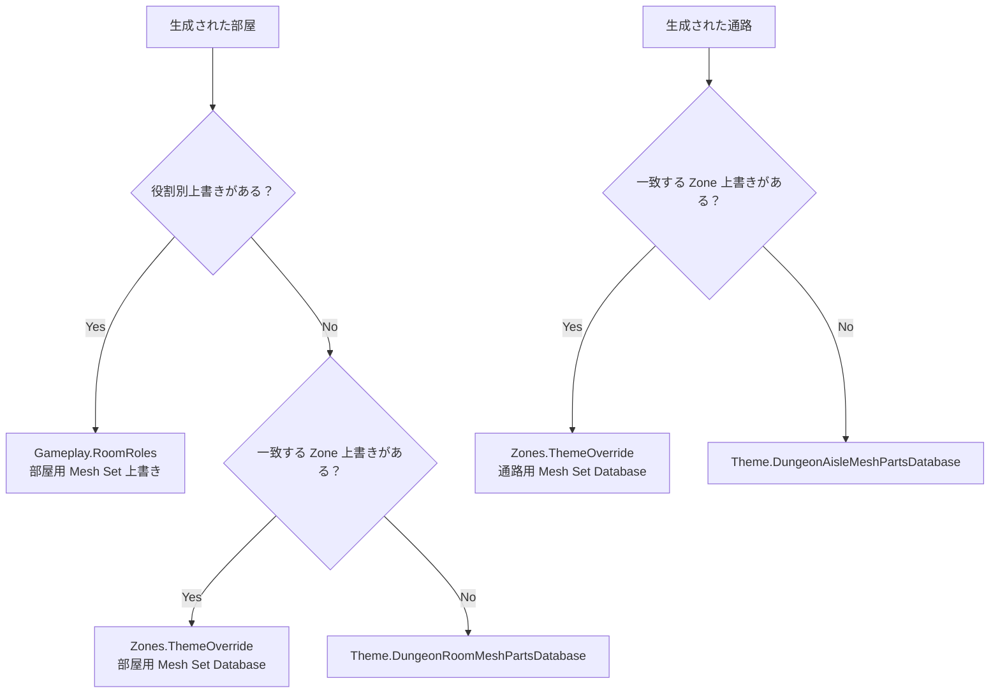
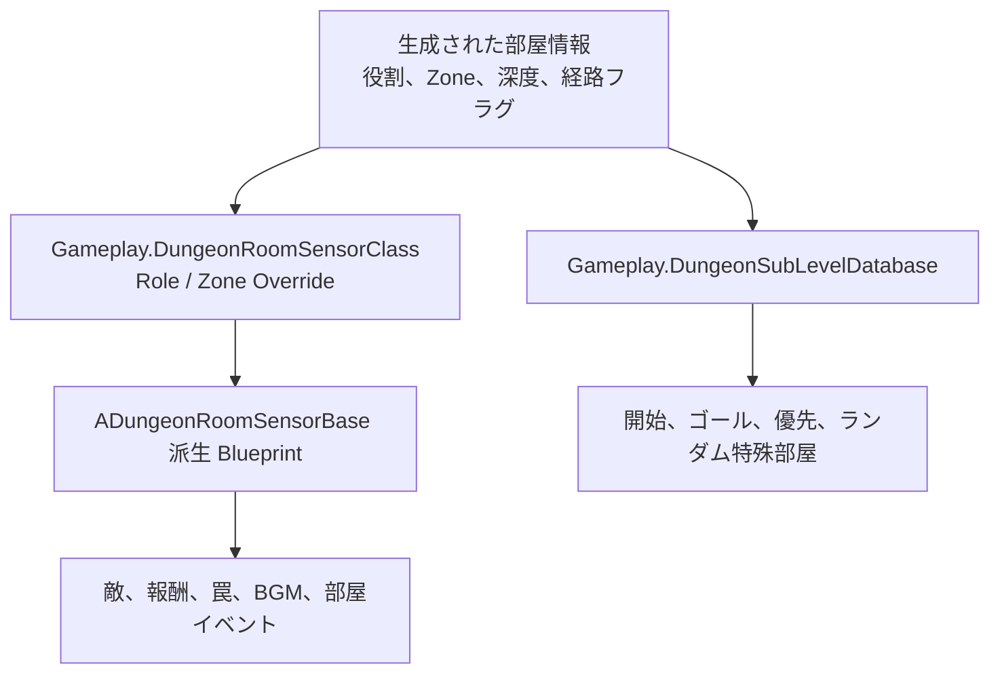

# UDungeonGenerateParameter ガイド

`UDungeonGenerateParameter` は、ダンジョン生成の中心になる設定アセットです。
2.0 では、設定を「レイアウト」「Zone による見た目の切り替え」「部屋情報を使ったユーザー実装」に分けて考えると理解しやすくなります。

## 主なデータグループ
2.0 では、v1 でトップレベルに並んでいた多くの設定が、目的別のグループに分かれています。

## まず設定するもの
- `Theme.DungeonRoomMeshPartsDatabase`
  部屋の床、壁、天井、シャンデリアなどを決める Mesh Set Database です。
- `Theme.DungeonAisleMeshPartsDatabase`
  通路の床、壁、天井などを決める Mesh Set Database です。
- `Theme.HorizontalGridSize` / `Theme.VerticalGridSize`
  メッシュ、サブレベル、部屋配置をそろえる基準サイズです。
- `RandomSeed`
  `0` は毎回ランダムです。固定値にすると同じ条件で結果を確認しやすくなります。

## レイアウトを調整する設定
- `Structure.RoomCountRange`
  生成する部屋数の目安です。Min と Max を同じ値にすると、部屋数を固定できます。
- `Structure.RoomWidth` / `RoomDepth` / `RoomHeight`
  部屋の大きさです。大きいほど広間寄り、小さいほど迷路寄りになります。
- `Structure.HorizontalRoomMargin` / `VerticalRoomMargin`
  部屋同士の間隔です。近い部屋を密集させたい場合は小さめにします。
- `Structure.FloorMode`
  `Free` は上下左右に広がる配置、`Flat` は同じ床高さの配置、`Vertical` は上下方向を重視した配置です。
## Path
`Path` には、開始・ゴールの選択、進行モデル、ループ経路、通路設定がまとまっています。

- `Path.StartRoomPolicy` / `Path.GoalRoomPolicy`
  スタート部屋とゴール部屋の選び方です。
- `Path.ProgressionPolicy`
  通常ルート、鍵付きルート、ボスルートなど、進行モデルを選びます。

  | Policy | 向いている用途 |
  | --- | --- |
  | `FreeExploration` | ループ、近道、寄り道部屋を含む自由探索型のダンジョン。 |
  | `StartToGoal` | スタートからゴールまでの主経路を分かりやすく見せたいダンジョン。 |
  | `KeysAndLocks` | 鍵で必要な扉を開けながら進む、迂回できない解けるルート。 |
  | `BossRoute` | ゴール付近のボス戦や最終遭遇に向けて盛り上げるルート。 |
  | `HubQuest` | ハブ部屋から複数のクエスト風分岐へ進むレイアウト。 |

画像の `S` はスタート、`G` はゴール、明るい線は代表的な進行経路を示します。`Free Exploration` はループや近道、`Start To Goal` は読み取りやすい主経路、`Keys And Locks` は Key を取得してから Lock を通る順序、`Boss Route` は終盤の Boss、`Hub Quest` は中央の Hub から広がる分岐が特徴です。この画像は各 Policy の違いを理解するための概念例であり、生成される部屋形状や装飾を固定するものではありません。

  まず `Path.ProgressionPolicy` を選んでください。これは経路の型を決める主な設定です。`Path.MainRouteBias`、`Path.LoopRouteDensity`、`Path.ExtraCorridorComplexity` は、選んだスタイルの中で結果を微調整する上級者向け設定です。
  v1 設定から移行する場合、`UseMissionGraph = true` は `Path.ProgressionPolicy = KeysAndLocks` に対応します。MissionGraph を使っていない通常の v1 アセットは `StartToGoal` に移行します。
- `Path.LayoutCandidateCount`
  複数のレイアウト候補を作り、スコアが高い候補を採用するための数です。
  値を上げると、良いレイアウトを選びやすくなりますが、その分だけ生成コストも増えます。まずは `3`、品質とコストのバランスを見るなら `4-8`、エディタで結果を確認する用途なら `9-16` を目安にしてください。
  実装上、`1` や `2` を指定しても最低 `3` 候補として扱われます。`8` を超える値はランタイム生成では重くなりやすいため、主にエディタ確認や固定シードでの調整向きです。
- `Path.MainRouteBias`
  主経路の強さを調整する上級者向け設定です。`0` は選んだ進行スタイルの標準です。負の値にすると分岐部屋が増える方向に寄り、正の値にすると主経路が長くなり分岐部屋が減る方向に寄ります。
- `Path.LoopRouteDensity`
  ループ経路や代替経路の多さを調整する上級者向け設定です。`0` は選んだ進行スタイルの標準です。値を上げると、そのポリシーが許す範囲でループが増えます。`KeysAndLocks` 進行では、鍵付き扉を迂回できないように安全ではないループは無効化されます。`StartToGoal`、`BossRoute`、`HubQuest` では途中の部屋にループを接続できますが、ゴール部屋は1接続の終端に保たれます。`FreeExploration` ではゴール付近のループも許可されます。
- `Path.ExtraCorridorComplexity`
  進行スタイルの経路ネットワークを作った後に、追加する通路の複雑度を調整する上級者向け設定です。`0` は選んだポリシー標準以上の追加通路を作らない設定です。`KeysAndLocks` 進行では、鍵付きルートを解ける状態に保つため、この値は無視され `0` として扱われます。
- `Path.CorridorCeilingHeightPolicy`
  通路の天井高さを `1 Grid`、`2 Grids`、`Random` から選びます。見た目だけでなく、通路側に置ける装飾の余裕にも影響します。

## Gameplay.RoomRoles
`Gameplay.RoomRoles.Roles` は、分岐部屋にどの役割を割り当てやすくするかと、役割ごとの部屋用 Mesh Set Database 上書きをまとめて設定します。
分岐部屋で選べるゲームプレイ役割は `None`、`Combat`、`Treasure`、`Puzzle`、`Rest`、`Secret` です。

| Role | 主な用途 |
| --- | --- |
| `None` | 特別なゲームプレイ意味を持たない通常の部屋。 |
| `Combat` | 敵遭遇や戦闘中心の部屋イベント。 |
| `Treasure` | 報酬、戦利品、鍵、その他の取得物。`KeysAndLocks` 進行の Key / UniqueKey 部屋も `Treasure` として扱われます。 |
| `Puzzle` | スイッチ、仕掛け、謎解き、インタラクション課題。 |
| `Rest` | 強い遭遇の間に置く、安全または低圧の部屋。 |
| `Boss` | 主に `BossRoute` で主経路終盤に割り当てられる大きな遭遇。 |
| `Secret` | 隠し発見、任意報酬、秘密イベント。 |

画像は各 Role をゲーム内でどう使えるかを示す例です。`None` は特別な用途を持たない通常部屋、`Combat` は戦闘、`Treasure` は報酬や鍵、`Puzzle` は仕掛け、`Rest` は休憩、`Boss` は大きな遭遇、`Secret` は隠し要素を表します。Role を設定しただけで画像の敵、宝箱、パズルが自動配置されるわけではありません。生成された Role を Room Sensor の Blueprint 処理や Role ごとの Theme Override で利用し、実際のゲーム内容と見た目を作ります。

`Start`、`Goal`、`Hub`、`Connector`、`Branch`、`DeadEnd` はルート側で決まる構造ロールです。`BossRoute` は主経路の終盤に `Boss` ゲームプレイ役割を割り当てます。`HubQuest` は主経路序盤の部屋を構造ロール `Hub` にします。`Boss` プロファイルを用意すれば、役割ごとの部屋メッシュ上書きには使えます。

秘密部屋を増やしたい場合は、`Secret` プロファイルの `BranchSelectionWeight` を上げます。秘密部屋だけを別の確率で指定する設定はありません。

部屋メッシュの優先順位は `Gameplay.RoomRoles` -> `Zones` -> `Theme` です。通路メッシュには役割別上書きは使われません。

## Zones
`Zones` は、進行度や階層に応じて Theme を切り替えるための設定です。

- `Zones[].Name`
  Zone の名前です。生成された部屋情報にも渡されます。
- `Zones[].ProgressRange`
  スタートからの進行度で Zone を適用する範囲です。
- `Zones[].FloorRange`
  適用する階層の範囲です。
- `Zones[].SelectionWeight`
  同じ進行度と階層に複数の Zone が一致したときに使う相対重みです。`0` にすると、その Zone は抽選されません。
- `Zones[].ThemeOverride`
  その Zone だけで使う部屋用、通路用 Mesh Set Database です。
- `Zones[].GameplayOverride`
  その Zone だけで使う Room Sensor クラスや通路 Actor 候補の上書きです。

複数の Zone が重なる場合、`ProgressRange` と `FloorRange` の両方に一致した Zone だけが抽選対象になります。範囲が重ならない Zone は、これまで通り範囲による切り替えとして扱えます。

Theme の優先順位は単純です。部屋メッシュは、該当する部屋役割の上書き、該当 Zone の上書き、`Theme` の標準 Database の順に使います。通路メッシュは Zone の上書き、または `Theme` の標準通路 Database を使います。

## Gameplay
`Gameplay` は、生成後にユーザー実装へつなぐ参照だけを持ちます。

- `Gameplay.DungeonRoomSensorClass`
  どの部屋にどの `ADungeonRoomSensorBase` 派生 Blueprint を使うかを決めます。
- `Gameplay.SpawnActorInAisle`
  生成通路内にスポーンするデフォルトの Actor Blueprint 候補です。`Zones[].GameplayOverride.SpawnActorInAisle` は、一致した Zone の通路でこの一覧を置き換えます。
- `Gameplay.DungeonSubLevelDatabase`
  スタート、ゴール、特殊部屋などに使うサブレベルを登録します。

敵、報酬、罠、演出などのゲームプレイ配置は、プラグインの報酬カテゴリで直接決めるのではなく、`ADungeonRoomSensorBase` 側で実装します。
`ADungeonRoomSensorBase` には、`bSecretRoom`、`bDeadEndRoom`、`bMainPathRoom`、`bLockedRouteRoom`、`ZoneName`、`DepthFromStartRatio` などの部屋情報が渡されます。

簡単な確認では、`Gameplay.DungeonRoomSensorClass` から Room Sensor Blueprint を割り当て、細かい Blueprint 分岐を追加する前に `ADungeonRoomSensorBase` の `DungeonGenerator|Helper` パラメータから試すと調整しやすくなります。

## Theme
Role / Zone の `ThemeOverride` では、部屋メッシュだけでなく `DungeonInteriorDatabase` と `Fixtures` も上書きできます。
これにより、Combat、Treasure、Secret などの役割や Zone に合わせて、家具、装飾、植生、柱、たいまつ、ドアをまとめて切り替えられます。
RoomRole の上書きは部屋にだけ使われ、通路と坂は Zone -> Theme の順に設定を使います。空の Interior / Fixture を意図的に使いたい場合は、対応する override フラグを有効にしてください。

- `Theme.DungeonInteriorDatabase`
  家具、装飾、植生などをタグで配置する Database です。
- `Theme.Fixtures`
  柱、松明、ドア、Unique Lock ドアなどの候補と選択ルールです。`UniqueDoorParts` は Keys And Locks 進行で作られるゴール扉やボスドア向けで、空の場合は `DoorParts` にフォールバックします。
- `Theme.Fixtures.*PartsSelector`
  柱、松明、ドア、Unique Lock ドアなどの候補を選ぶためのセレクターオブジェクトです。
- `Theme.bDeferredVegetationSpawn`
  Play開始時の停止を抑えるため、植生を複数フレームに分けて生成します。1フレームあたりの生成数やツリー構築時間は `Theme|VegetationPerformance` の関連設定で調整します。ランタイム中の Actor、ライト、AI、collision、Tick の制御は [LoadReduction.ja.md](./LoadReduction.ja.md) を参照してください。

## 推奨の考え方
最初は `Structure`、`Path`、`Theme` だけで生成を安定させます。
その後、分岐部屋の性格や役割ごとの部屋の見た目を変えたい場合は `Gameplay.RoomRoles`、見た目を場所ごとに切り替えたい場合は `Zones`、敵や報酬などを置きたい場合は `Gameplay.DungeonRoomSensorClass` と `ADungeonRoomSensorBase` を調整してください。

## 関連ページ
- [UDungeonMeshSetDatabase.ja.md](./UDungeonMeshSetDatabase.ja.md)
- [UDungeonSubLevelDatabase.ja.md](./UDungeonSubLevelDatabase.ja.md)
- [ADungeonRoomSensorBase.ja.md](./ADungeonRoomSensorBase.ja.md)
