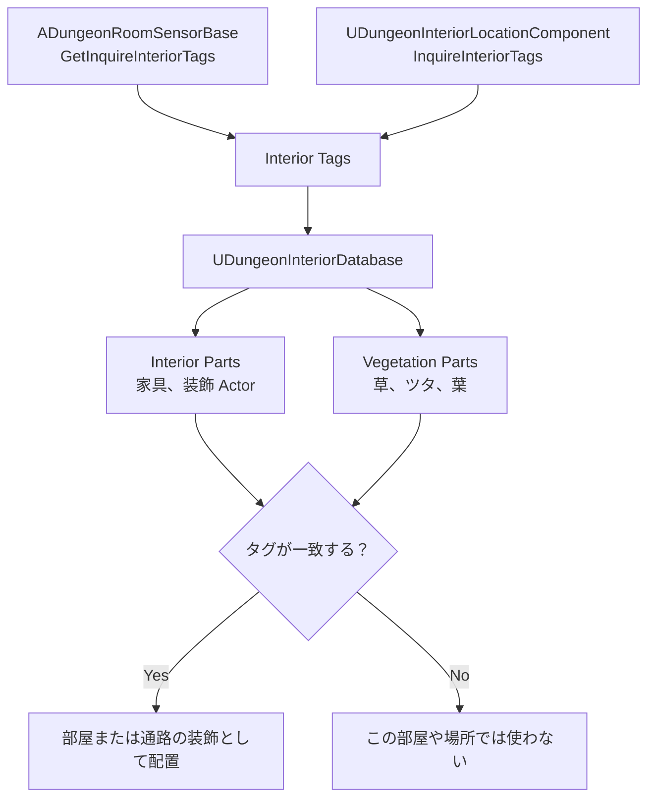

# UDungeonInteriorDatabase ガイド

`UDungeonInteriorDatabase` は、タグを使って家具、装飾、植生を配置するためのデータベースです。  
部屋ごとに雰囲気を変えたいときや、特定のタグを持つ部屋だけに家具や植物を置きたいときに使います。

## 管理するもの
- `Interior Parts`  
  家具や装飾など、Actor としてスポーンする内装パーツです。
- `VegetationParts`  
  草、ツタ、葉などの植生向け装飾です。

## タグの流れ
Interior の選択は、部屋側から返されたタグと、この Database 内のパーツに設定されたタグが一致したときに行われます。  
主な入力元は次の 2 つです。

- `ADungeonRoomSensorBase::GetInquireInteriorTags`
- `UDungeonInteriorLocationComponent::InquireInteriorTags`

たとえば、部屋側が `library` を返し、Database 内の内装パーツにも `library` が設定されていれば、その家具が配置候補になります。

## 主な項目
- `Interior Parts`
  - 家具や装飾の Actor Class
  - システムタグ
  - 追加タグ
  - スポーン頻度
  - 重なりチェック
  - スポーン方法
- `VegetationParts`
  - 植生用メッシュ
  - タグ
  - 密度
  - 傾斜条件
  - カリング距離

## `Build` が必要な理由
`Interior Parts` は、`Build` 実行時に Actor の Bounds 情報を事前計算します。  
家具の大きさや Actor Class を変更したあとに `Build` を忘れると、配置チェックに古い情報が使われる場合があります。

## 使い方の流れ
1. 家具や装飾用 Blueprint / C++ Actor を `Interior Parts` に登録します。
2. 必要なら `VegetationParts` に植生を登録します。
3. 部屋側、または `DungeonInteriorLocationComponent` から使いたいタグを返します。
4. `Build` を実行します。
5. `UDungeonGenerateParameter` の `Theme.DungeonInteriorDatabase` にこのアセットを指定します。

## 編集のヒント
- 最初は `start`、`goal`、`hall` など広いタグから始めると管理しやすいです。
- レイアウトが増えてから `kitchen` や `library` など細かいタグを追加すると破綻しにくいです。
- 家具だけを差し替えたいときは `Interior Parts`、植物だけを調整したいときは `VegetationParts` を編集します。

## 次に読む
- [ADungeonRoomSensorBase.ja.md](./ADungeonRoomSensorBase.ja.md)  
  部屋イベント側から Interior タグを返す流れを確認できます。
- [UDungeonGenerateParameter.ja.md](./UDungeonGenerateParameter.ja.md)  
  メイン設定アセットのどこにこの Database を指定するかを確認できます。

## 関連ページ
- [ADungeonRoomSensorBase.ja.md](./ADungeonRoomSensorBase.ja.md)
- [UDungeonGenerateParameter.ja.md](./UDungeonGenerateParameter.ja.md)
