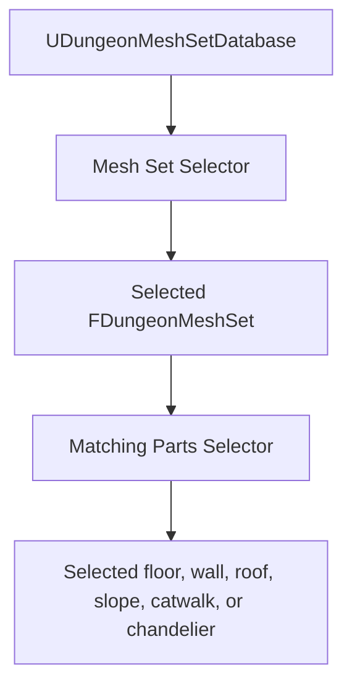

# UDungeonMeshSetDatabase Guide

`UDungeonMeshSetDatabase` groups visual themes for floors, walls, roofs, slopes, catwalks, and chandeliers. Usually you create separate room and aisle databases and assign them through `UDungeonGenerateParameter`.

## How selection works

Selection happens in two stages:

`Mesh Set Selector` chooses one entry from `Mesh Set`. The matching selector inside that `FDungeonMeshSet` then chooses one candidate part. If a selector is empty, Uniform Random is assigned automatically.

## Minimum setup

1. Create a `Mesh set database` asset.
2. Add one `Mesh Set`.
3. Add at least one `Floor Parts`, `Wall Parts`, and `Roof Parts` entry.
4. Add `Slope Parts` before using a layout that can create height differences.
5. Assign the asset to `Theme.DungeonRoomMeshPartsDatabase` or `Theme.DungeonAisleMeshPartsDatabase`.
6. Run `Verify` before generating.

Missing floor, wall, or roof candidates are validation errors. Missing slope candidates produce a warning because flat layouts can work without them, but visible vertical transitions require a slope.

## Mesh Set Selector

The built-in mesh-set selectors are useful for common theme rules:

- `UDungeonUniformRandomMeshSetSelector`: varies the selected Mesh Set.
- `UDungeonIdentifierMeshSetSelector`: chooses deterministically from the room identifier.
- `UDungeonDepthFromStartMeshSetSelector`: moves through the candidate order as progress from the start increases.
- `UDungeonBlueprintMeshSetSelector`: lets a Blueprint implement `Select Mesh Set Index` for project-specific rules.

Candidate order matters for index- and depth-based selectors. Place early-area themes before late-area themes when using Depth From Start.

## Selectors inside each FDungeonMeshSet

Each Mesh Set contains the candidate arrays and the selector used for each array:

- `Floor Parts` and `Floor Parts Selector`
- `Wall Parts` and `Wall Parts Selector`
- `Roof Parts` and `Roof Parts Selector`
- `Slope Parts` and `Slope Parts Selector`
- `Catwalk Parts` and `Catwalk Parts Selector`
- `Chandelier Parts` and `Chandelier Parts Selector`

Parts selectors include Uniform Random, Grid Index, Direction, and Blueprint-extensible selection. Choose the simplest selector that gives the intended result. See [CustomSelector.en.md](./CustomSelector.en.md) before adding custom logic.

## Chandeliers

Chandeliers are configured per `FDungeonMeshSet`, so each theme can have different fixtures and placement density.

1. Add `FDungeonRandomActorParts` entries to `Chandelier Parts`.
2. Set `Chandelier Parts Selector` when you need something other than Uniform Random.
3. Tune `ChandelierMinSpacing`, `ChandelierMinCeilingHeight`, `ChandelierRadius`, `ChandelierWallWeight`, and `ChandelierCombatWeight`.

- `ChandelierMinSpacing` prevents decorations from clustering too closely.
- `ChandelierMinCeilingHeight` avoids placing them in rooms without enough clearance.
- `ChandelierRadius` is used for placement collision checks; larger actors usually need a larger value.
- `ChandelierWallWeight` and `ChandelierCombatWeight` adjust the preference for positions away from walls or near combat-oriented centers.

If deeper rooms should look more luxurious, put chandelier-rich settings in a later Mesh Set and use Depth From Start selection.

## Version 1 note

Old Selection Policy, Selection Method, and legacy custom-selector values can remain as hidden serialized implementation fields. They are not Version 2 editing controls and do not make Version 1 assets supported in Version 2. Rebuild the database with the visible `Mesh Set Selector` and `Parts Selector` properties.

## Related Pages

- [FDungeonMeshParts.en.md](./FDungeonMeshParts.en.md)
- [FDungeonRandomActorParts.en.md](./FDungeonRandomActorParts.en.md)
- [UDungeonGenerateParameter.en.md](./UDungeonGenerateParameter.en.md)
- [CustomSelector.en.md](./CustomSelector.en.md)
