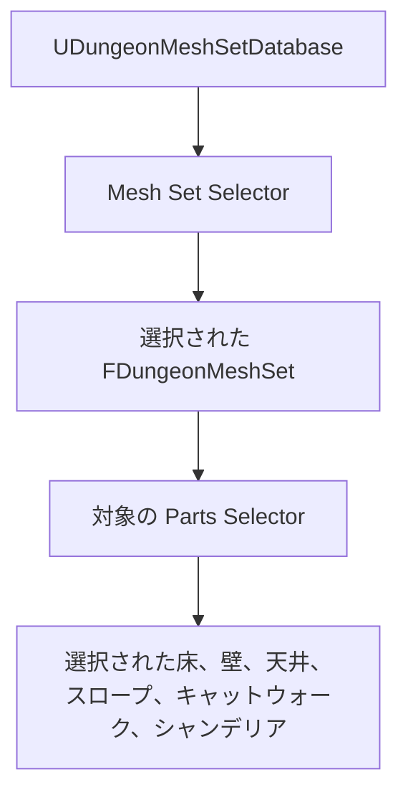

# UDungeonMeshSetDatabase ガイド

`UDungeonMeshSetDatabase` は、床、壁、天井、スロープ、キャットウォーク、シャンデリアの見た目を Theme としてまとめるアセットです。通常は部屋用と通路用を別々に作り、`UDungeonGenerateParameter` から割り当てます。

## 選択の仕組み

選択は 2 段階で行われます。

`Mesh Set Selector` が `Mesh Set` から 1 項目を選び、その `FDungeonMeshSet` 内の対応するセレクターが候補パーツを 1 つ選びます。セレクターが空の場合は Uniform Random が自動的に割り当てられます。

## 最低限の設定

1. `Mesh set database` アセットを作ります。
2. `Mesh Set` を 1 項目追加します。
3. `Floor Parts`、`Wall Parts`、`Roof Parts` をそれぞれ 1 項目以上追加します。
4. 高低差を生成するレイアウトを使う前に `Slope Parts` を追加します。
5. `Theme.DungeonRoomMeshPartsDatabase` または `Theme.DungeonAisleMeshPartsDatabase` に割り当てます。
6. 生成前に `Verify` を実行します。

床、壁、天井の候補不足は検証エラーです。スロープ不足は、平坦なレイアウトなら動作できるため警告ですが、高低差を正しく表示するには必要です。

## Mesh Set Selector

一般的な Theme 切り替えには、次の組み込み Mesh Set セレクターを使えます。

- `UDungeonUniformRandomMeshSetSelector`: Mesh Set をランダムに変化させます。
- `UDungeonIdentifierMeshSetSelector`: 部屋 Identifier から決定的に選びます。
- `UDungeonDepthFromStartMeshSetSelector`: スタートからの進行度に合わせて候補順を進めます。
- `UDungeonBlueprintMeshSetSelector`: Blueprint の `Select Mesh Set Index` でプロジェクト固有の規則を実装します。

インデックスや進行度を使うセレクターでは候補順が重要です。Depth From Start を使う場合は、序盤用 Theme から終盤用 Theme の順に並べてください。

## FDungeonMeshSet 内のセレクター

各 Mesh Set には、候補配列とその配列用のセレクターがあります。

- `Floor Parts` と `Floor Parts Selector`
- `Wall Parts` と `Wall Parts Selector`
- `Roof Parts` と `Roof Parts Selector`
- `Slope Parts` と `Slope Parts Selector`
- `Catwalk Parts` と `Catwalk Parts Selector`
- `Chandelier Parts` と `Chandelier Parts Selector`

Parts Selector には Uniform Random、Grid Index、Direction、Blueprint で拡張する方式があります。意図した結果を得られる最も単純なものを選んでください。独自処理を追加する前に [CustomSelector.ja.md](./CustomSelector.ja.md) を確認してください。

## シャンデリア

シャンデリアは `FDungeonMeshSet` ごとに設定するため、Theme ごとに種類や配置密度を変えられます。

1. `Chandelier Parts` に `FDungeonRandomActorParts` を追加します。
2. Uniform Random 以外の選択が必要なら `Chandelier Parts Selector` を設定します。
3. `ChandelierMinSpacing`、`ChandelierMinCeilingHeight`、`ChandelierRadius`、`ChandelierWallWeight`、`ChandelierCombatWeight` を調整します。

- `ChandelierMinSpacing` は、装飾が密集しすぎるのを防ぎます。
- `ChandelierMinCeilingHeight` は、高さが足りない部屋への配置を避けます。
- `ChandelierRadius` は配置時の衝突確認半径です。大きな Actor ほど大きめにします。
- `ChandelierWallWeight` と `ChandelierCombatWeight` は、壁から離れた位置や戦闘中心に近い位置をどの程度優先するか調整します。

奥ほど豪華にしたい場合は、シャンデリアを多く含む Mesh Set を後ろに置き、Depth From Start で選択します。

## Version 1 に関する注意

旧 Selection Policy、Selection Method、旧カスタムセレクターの値が、非表示の保存用フィールドとして残る場合があります。これらは Version 2 の編集項目ではなく、Version 1 アセットが Version 2 でサポートされることも意味しません。表示されている `Mesh Set Selector` と各 `Parts Selector` を使って手動でデータベースを作り直してください。

## 関連ページ

- [FDungeonMeshParts.ja.md](./FDungeonMeshParts.ja.md)
- [FDungeonRandomActorParts.ja.md](./FDungeonRandomActorParts.ja.md)
- [UDungeonGenerateParameter.ja.md](./UDungeonGenerateParameter.ja.md)
- [CustomSelector.ja.md](./CustomSelector.ja.md)
