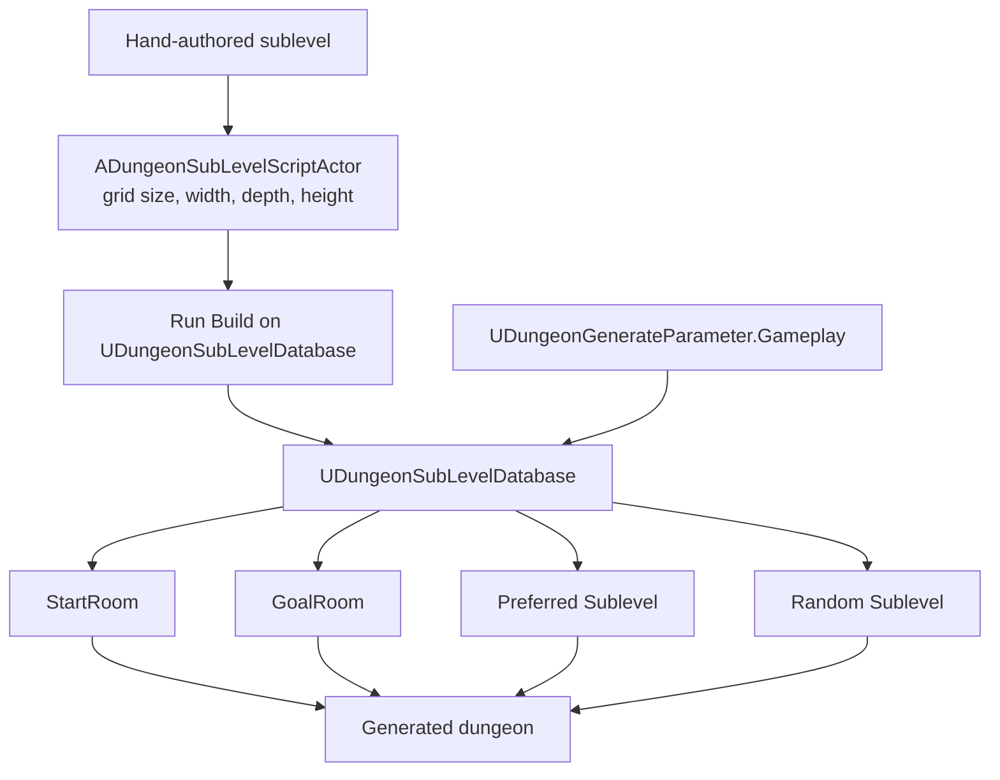

# UDungeonSubLevelDatabase Guide

`UDungeonSubLevelDatabase` is the database used to insert hand-authored special-room levels into the dungeon.  
Use it to manage start rooms, goal rooms, rooms that must appear, or random hidden/event rooms.

## When it is useful
- You want a fixed-design start room
- You want a hand-authored goal room or boss room
- You want to mix in hidden rooms or event rooms at random

## Prerequisite
Levels registered in this database should be created as sublevels whose parent class is `ADungeonSubLevelScriptActor`.  
Because `Build` reads size and grid information from those levels, **running `Build` after edits is required**.

## Main properties
- `GridSize` / `VerticalGridSize`  
  Display-only values. The actual values are copied from `ADungeonSubLevelScriptActor` inside each sublevel.
- `StartRoom`  
  A fixed sublevel used as the start room. If `LevelPath` is empty, generation falls back to an auto-generated start room.
- `GoalRoom`  
  A fixed sublevel used as the goal room. If `LevelPath` is empty, generation falls back to an auto-generated goal room.
- `Preferred Sublevel` (`DungeonRoomRegister`)  
  Sublevels that should always appear or be strongly preferred.
- `Random Sublevel` (`DungeonRoomLocator`)  
  Sublevels inserted by random draw into rooms that satisfy the conditions.
- `Random Sublevel Draw Count`  
  Maximum number of random draws. `0` means all candidates are considered.

## `Preferred Sublevel` vs `Random Sublevel`
- `Preferred Sublevel`  
  Better for fixed or strongly preferred special rooms. For example, "this boss room should always appear."
- `Random Sublevel`  
  Better for conditional random insertion. For example, "spawn this hidden room only with some probability."

Each `FDungeonRoomLocator` entry inside `Random Sublevel` can hold conditions such as:

- Width / depth / height conditions
- Which room types are allowed
- Which structural roles are allowed (`AllowedStructuralRoles`)
- Which gameplay roles are allowed (`AllowedGameplayRoles`)
- Which item-room types are allowed
- `AddingProbability`

`AllowedStructuralRoles` and `AllowedGameplayRoles` are only used by `Random Sublevel`. Leave either list empty to avoid filtering by that role axis. Preferred start, goal, and reservation-number sublevels keep their existing priority and do not use these filters.

## Typical flow
1. Create a level for the special room and set its parent class to `ADungeonSubLevelScriptActor`.
2. Configure `GridSize`, `VerticalGridSize`, `Width`, `Depth`, and `Height` on the sublevel side.
3. Register the level in `StartRoom`, `GoalRoom`, `Preferred Sublevel`, or `Random Sublevel`.
4. Run `Build`.
5. Assign this asset to `Gameplay.DungeonSubLevelDatabase` in `UDungeonGenerateParameter`.

## Editing tips
- The main `UDungeonGenerateParameter` grid size and the sublevel grid size must always match.
- If you edit a sublevel and forget to run `Build`, old size or connection information may remain.
- `Build` temporarily loads levels for analysis, so it is safer not to target the level you are currently editing.
- If you want to use a preloaded lobby itself as the start room, use `StartRoomSubLevelScriptActor` on `ADungeonGenerateActor` instead of this database. While that actor setting is set, this database's `StartRoom` is ignored for the start room.

## Read Next
- [ADungeonSubLevelScriptActor.en.md](./ADungeonSubLevelScriptActor.en.md)  
  Review the required actor that each special-room sublevel should use.
- [LobbyConnection.en.md](./LobbyConnection.en.md)  
  Compare start-room sublevels against existing-lobby connections.

## Related Pages
- [ADungeonSubLevelScriptActor.en.md](./ADungeonSubLevelScriptActor.en.md)
- [LobbyConnection.en.md](./LobbyConnection.en.md)
- [ADungeonGenerateActor.en.md](./ADungeonGenerateActor.en.md)
- [UDungeonGenerateParameter.en.md](./UDungeonGenerateParameter.en.md)
