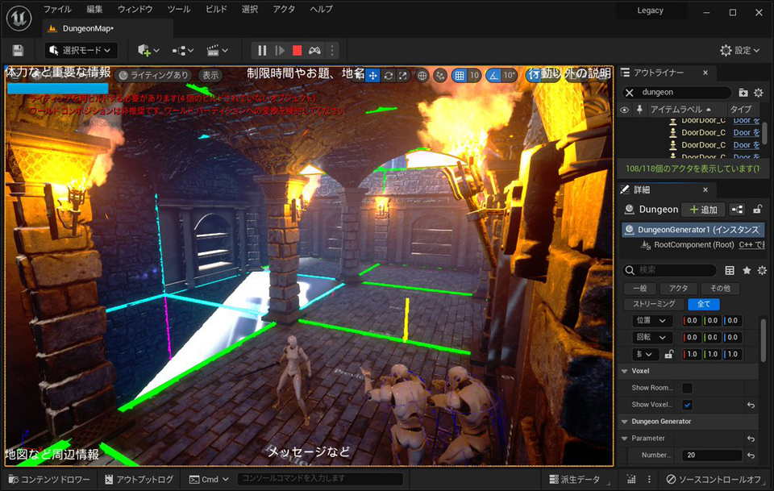
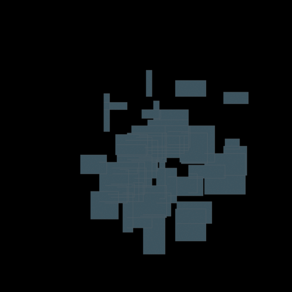

# Dungeon generator plugin for Unreal Engine

One day I wanted to create a video game, but I didn't have the level design know-how. So I decided to create a procedural dungeon generator.
The dungeon generator was based on Vazgriz's algorithm. You can read more about [Vazgriz's algorithm here](https://vazgriz.com/119/procedurally-generated-dungeons/).

This is an easy to use. Simply drop the DungeonGenerateActor into your level, set the grid scale and number of rooms and start generating out your structures. 

Please read the [Wiki](https://github.com/shun126/DungeonGenerator/wiki) for more information.

# Feature

* DungeonGenerator is a plug-in for UnrealEngine.
* Tiled Dungeon Generation both In-Editor & Runtime
* Users can easily generate dungeons by preparing meshes for floors, walls, ceilings, and stairs.
* A mini-map of the dungeon can be generated. [beta version]
* Generates actors for doors and keys by MissionGraph. [beta version]
* Supported Development Platforms: Windows (should be possible to build on all platforms)
* Supported Target Build Platforms: Windows (should be possible to target all platforms)

This is the screenshot of our sample game.

Visualization of dungeon generation status.

# Requirements
* [Unreal Engine 5.1.1](https://www.unrealengine.com/unreal-engine-5)
* [Visual Studio 2022](https://visualstudio.microsoft.com/)

# License
* GPL-3.0

# Author
* [Shun Moriya](https://twitter.com/moriya_zx25r)
* [Nonbiri](https://www.youtube.com/channel/UCkLXe57GpUyaOoj2ycREU1Q)
