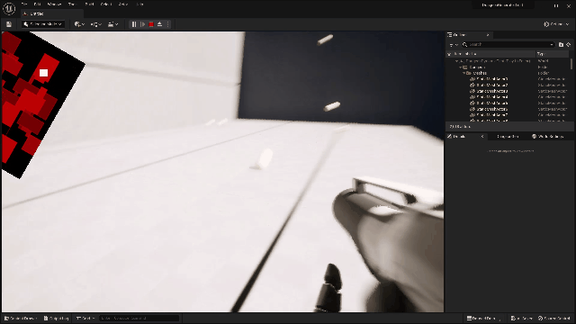

# Dungeon Generator for Unreal Engine 5

Build grid-based 3D dungeons for roguelike, action RPG, and exploration games in Unreal Engine 5.

Dungeon Generator creates playable dungeon layouts from a small set of parameters and mesh parts. You can preview dungeons in the editor, generate them at runtime, and integrate the system from Blueprint or C++. The open-source version is designed for developers who want to prototype procedural levels, study the generation pipeline, or build a custom dungeon system on top of a practical Unreal Engine plugin.

## Why Use It?

- Generate tiled 3D dungeons in the editor or during gameplay
- Start with your own floor, wall, roof, stair, and door meshes
- Control room count, grid size, start position, and generation rules
- Add doors, keys, and route progression with MissionGraph
- Use Blueprint or C++ depending on your project workflow
- Test multiplayer-oriented projects with dungeon replication support

Dungeon Generator is useful when you want a working dungeon structure quickly, but still need enough control to adapt it to your game's art style and rules.

## Open-Source Version

This repository provides the open-source version of Dungeon Generator under the GPL license.

It is a good fit if you want to:

- Try procedural dungeon generation in Unreal Engine 5
- Learn how a grid-based 3D dungeon generator is built
- Prototype roguelike, hack-and-slash, dungeon crawler, or exploration mechanics
- Customize the plugin source for your own project

For the fastest path, start with the tutorial index:

[Dungeon Generator Tutorial](Document/tutorial/README.en.md)

## Quick Start

1. Install the plugin in your Unreal Engine project.
2. Enable the plugin content.
3. Open the demonstration map from the plugin content.
4. Run the project or preview generation from the editor.
5. Create a `DungeonGenerateParameter` asset and adjust the grid size, room count, and mesh databases.

For a beginner-friendly walkthrough, read:

[QuickStart.en.md](Document/tutorial/QuickStart.en.md)

## Main Features

- Procedural 3D dungeon generation for Unreal Engine 5
- Editor generation and runtime generation
- Blueprint and C++ access
- Custom mesh parts for floors, walls, roofs, slopes, pillars, doors, and actors
- MissionGraph support for doors, keys, and progression routes
- Dungeon replication support
- Demo content and tutorial documentation

## Using Your Own Meshes

Dungeon Generator is built around reusable mesh parts. You prepare meshes for floors, walls, roofs, slopes, and other dungeon pieces, then register them in mesh databases.

Start here if you want to replace the sample visuals with your own assets:

[PrepareMeshParts.en.md](Document/tutorial/PrepareMeshParts.en.md)

## Epic/Fab Version

The [Epic/Fab version](https://fab.com/s/f5587c55bad0) includes additional production-focused features for teams that need more advanced level-building workflows.

Additional features include:

- Sub-levels as dungeon rooms
- Mini-map generation
- Interior decoration
- Foliage decoration
- Mesh Set and Custom Mesh Selection
- StaticMesh Fit Tool

Important: The StaticMesh Fit Tool is supported only in the Epic/Fab version. 

If you need these features or a license other than GPL, please consider the [Epic/Fab version](https://fab.com/s/f5587c55bad0).

Please visit our website for full feature list: [https://happy-game-dev.undo.jp/](https://happy-game-dev.undo.jp/plugins/DungeonGenerator/index.html)

## Requirements

- Unreal Engine 5.1 to 5.7
- Visual Studio 2022

## Demo Project

The demo project shows a first-person exploration setup using Dungeon Generator:

[DungeonGenerator Demo](https://github.com/shun126/UE5-DungeonGeneratorDemo)

## License

The open-source version is distributed under the GNU General Public License v3.0 or later.

The Epic/Fab version is released under the Epic license. If GPL does not fit your project, use the Epic/Fab version instead.
