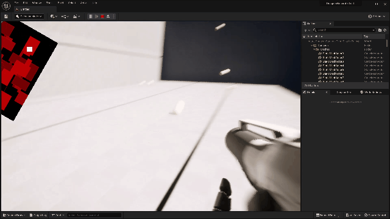

# Dungeon Generator for Unreal Engine 5

[](https://github.com/shun126/DungeonGenerator/blob/main/LICENSE)
[](https://www.unrealengine.com/)
[](https://github.com/shun126/DungeonGenerator/releases)
[](https://github.com/shun126/DungeonGenerator/releases)
[](https://github.com/shun126/DungeonGenerator/stargazers)
[](https://discord.com/invite/Z5JWmk4X8J)
[](https://youtu.be/1igd4pls5x8)

**Design the adventure, not just the floor plan.**

Dungeon Generator creates replayable 3D dungeons for Unreal Engine 5 from your mesh parts and a designer-friendly set of parameters. Build branching routes, keys and locks, boss encounters, secrets, and rooms with distinct gameplay purposes—then preview the result in the editor or generate it at runtime.



Try the sample maps included in the plugin, follow the [Quick Start](Document/tutorial/QuickStart.en.md), or view the production-focused [Epic/Fab version](https://fab.com/s/f5587c55bad0).

## Dungeon Generator 2.0

Version 2.0 is a major redesign focused on three goals: **engaging level design, lived-in visual variety, and settings that are easier to tune**.

> **Warning — breaking changes:** Version 2 does not support migration from Version 1. Do not install v2 over a working v1 project or expect v1 Dungeon Generator assets and settings to be converted. Keep the v1 project and plugin version intact, and set up v2 separately as a new implementation.

- Choose a progression style instead of assembling every route rule by hand
- Give generated rooms clear purposes such as combat, treasure, rest, boss, and secret
- Change visuals and gameplay by depth, floor, Zone, or room Role
- Evaluate multiple layout candidates and keep the result that best matches your design intent
- Organize settings into `Theme`, `Structure`, `Path`, `Zones`, and `Gameplay`
- Connect generated room information to Blueprint or C++ gameplay systems
- Scale to larger runtime dungeons with detailed activation and load controls

For a complete feature comparison and guidance on rebuilding a v1 design in v2, see [v1.x and v2.0.0 Comparison](Document/tutorial/VersionComparison.en.md). For release details, see the [CHANGELOG](CHANGELOG.md).

## Shape How the Dungeon Plays

Start with `Path.ProgressionPolicy` and choose the structure that fits your game:

| Progression Policy | Player experience | Good fit for |
| --- | --- | --- |
| `Free Exploration` | Loops, shortcuts, and optional side rooms | Roguelites, exploration, collection |
| `Start To Goal` | A readable main route with controlled branches | Dungeon crawlers and guided progression |
| `Keys And Locks` | Keys unlock a route that cannot be bypassed | Escape games and staged progression |
| `Boss Route` | Encounters and rest build toward a final boss | Action RPGs and boss-focused runs |
| `Hub Quest` | An early hub leads to several objective branches | Quest and objective-based layouts |


## Turn Rooms into Gameplay

Gameplay Roles describe why a room exists: `Combat`, `Treasure`, `Puzzle`, `Rest`, `Boss`, or `Secret`. Use those Roles from Room Sensors, Blueprint, or C++ to place enemies and rewards, trigger events, change decoration, or control pacing.

Roles provide design intent rather than forcing one game system. You decide what “Treasure” or “Boss” means in your project.


## Build a Dungeon That Feels Lived In

Dungeon Generator is built around reusable mesh parts and data assets, so one generation system can support many visual themes.

- Use your own floors, walls, roofs, slopes, pillars, doors, and Actors
- Vary Mesh Sets, Interiors, Fixtures, and vegetation by room Role or Zone
- Create hand-authored special rooms with sub-levels
- Combine procedural structure with authored furniture and decoration points
- Use selectors in Blueprint or C++ when random selection is not enough

Some of the advanced visual-production features above are exclusive to the Epic/Fab version, as described below.

## What You Can Build

- Editor previews and runtime-generated dungeons
- Single-floor and multi-floor 3D layouts
- Loops, branches, secret rooms, locked routes, and boss routes
- Room-driven combat, rewards, puzzles, rest areas, and events
- Minimap and exploration-map experiences
- Multiplayer-oriented projects with dungeon replication support
- Custom generation and selection rules through Blueprint or C++

Dungeon Generator is a strong fit for roguelikes, action RPGs, dungeon crawlers, exploration games, and prototypes that need replayable spaces without giving up control over pacing or identity.

## Epic/Fab Version

The [Epic/Fab version](https://fab.com/s/f5587c55bad0) is intended for production teams and creators who want the complete level-building workflow under the Epic license.

It adds:

- Sub-levels used as authored dungeon rooms
- Minimap generation and map-support features
- Interior and foliage decoration
- Mesh Set and custom mesh selection
- StaticMesh Fit Tool for adapting meshes to the dungeon grid

[](https://fab.com/s/f5587c55bad0)

The StaticMesh Fit Tool is available only in the Epic/Fab version. If GPL is not suitable for your project, or you need the production-focused feature set, choose the [Epic/Fab version](https://fab.com/s/f5587c55bad0).

See the [product website](https://happy-game-dev.undo.jp/plugins/DungeonGenerator/index.html) for the full feature list.

## Open-Source Version

This repository provides the GPL-licensed open-source version. It is a good fit when you want to:

- Evaluate procedural dungeon generation in Unreal Engine 5
- Learn how a grid-based 3D dungeon generator is implemented
- Prototype gameplay before choosing a production workflow
- Study or customize the plugin source under the GPL

Plugin developers can explore the source to see how layout generation, voxel data, room metadata, runtime generation, and Unreal Engine integration work together.

## Quick Start

1. Install and enable the plugin in your Unreal Engine project.
2. Enable plugin content in the Content Browser.
3. Open `Content/Maps/Demonstration` for the standard runtime-generation sample, or `Content/Maps/DemonstrationWithStartRoom` for the authored start-room sample.
4. Run the map or preview a dungeon from the editor.
5. Create a `DungeonGenerateParameter` asset and adjust its Structure, Path, and database references.

The [beginner-friendly Quick Start](Document/tutorial/QuickStart.en.md) explains each step. To use your own art, continue with [Preparing Mesh Parts](Document/tutorial/PrepareMeshParts.en.md).

## Included Sample Maps

The samples are part of the plugin content, so no separate demo project is required.

- `Content/Maps/Demonstration.umap` — standard dungeon generation, gameplay, minimap, and plugin-content example
- `Content/Maps/DemonstrationWithStartRoom.umap` — connects an authored start-room sub-level to the generated dungeon

If the `Content/Maps` folder is hidden, open the Content Browser settings and enable `Show Plugin Content`.

## Multiplayer

The server picks the seed and every peer builds the dungeon from it; only the seed and a checksum
are replicated. Two things follow from that.

**Use a saved Parameter Asset.** The parameter is replicated as an object reference, so it needs a
path that exists on every peer. A parameter created at runtime, including the result of
`GenerateRandomParameter`, has no such path, arrives at the client as null, and leaves that client
without a dungeon. The server reports `DG_NET_PARAMETER_NOT_REPLICABLE` when this happens.

**Build the server and the clients for the same platform.** Generation is only reproducible when
every peer runs the same plugin version, with the same Parameter Asset, built with the same
compiler. A Windows client with a Linux dedicated server is not verified for 2.0. When a client
does build a different dungeon, the checksum catches it, the dungeon is discarded and the
generation is failed rather than letting that player explore a world nobody else can see.

Handle both cases from `OnGenerationFailure`, then read the reason:

```cpp
for (const FDungeonValidationIssue& issue : DungeonGenerateActor->GetLastGenerationIssues())
{
    // DG_NET_CRC_MISMATCH or DG_NET_PARAMETER_NOT_REPLICABLE means this client cannot join
    // the dungeon the others are in. Leave the session instead of continuing.
    UE_LOG(LogTemp, Error, TEXT("%s: %s"), *issue.Code.ToString(), *issue.Message.ToString());
}
```

The plugin does not recover on its own, because it cannot. Retrying with another seed would
guarantee a different dungeon, retrying with the same seed repeats the same result, and asking the
server for a new one punishes every other player. Returning the player to a menu or reconnecting
is the game's decision. A client that fails once is not stuck for good: the next revision the
server publishes is applied normally.

## Documentation

- [Tutorial index](Document/tutorial/README.en.md)
- [Quick Start](Document/tutorial/QuickStart.en.md)
- [v1.x and v2.0.0 Comparison](Document/tutorial/VersionComparison.en.md)
- [Preparing Mesh Parts](Document/tutorial/PrepareMeshParts.en.md)
- [Questions and support](https://github.com/shun126/DungeonGenerator/discussions)
- [Discord community](https://discord.com/invite/Z5JWmk4X8J)

## Requirements

- Unreal Engine 5.1 to 5.8
- Visual Studio 2022 when building the plugin from source

## License

The open-source version is distributed under the GNU General Public License v3.0 or later.

The Epic/Fab version is released under the Epic license. If GPL does not fit your project, use the [Epic/Fab version](https://fab.com/s/f5587c55bad0).
