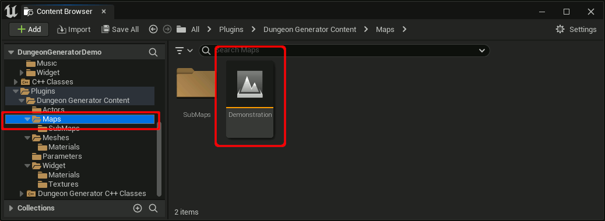

<h1>Dungeon generator plugin for Unreal Engine 5</h1>

<a href="https://github.com/shun126/UE5-DungeonGeneratorDemo/issues">Issues</a>,
<a href="https://github.com/shun126/UE5-DungeonGeneratorDemo/discussions">Discussions</a>,
<a href="https://github.com/shun126/UE5-DungeonGeneratorDemo/wiki">Wiki</a>,
<a href="https://mnu.sakura.ne.jp/_doxygen/dungeon_generator">Doxygen</a>

Please also take a look at the [Fab](https://fab.com/s/f5587c55bad0) version.

* Trailer video: [YouTube](https://youtu.be/1igd4pls5x8)
* Tutorial videos: [YouTube](https://www.youtube.com/playlist?list=PLlMDkSa8bQnK4PDIfkXYorQIucn47ifKO)

Revolutionize your dungeon creation process with our new Unreal Engine plugin! Enjoy freedom and customize your own rulesets to offer players unique and engaging dungeon exploration experiences. Say goodbye to the hassle of manual dungeon building and welcome the new age of dungeon exploration!

# 🚩 Table of Contents
- [Why Dungeon Generator?](#-why-dungeon-generator)
- [Features](#-features)
- [Requirements](#-requirements)
- [License](#-license)
- [Demo](#-demo)
- [See also](#-see-also)
- [Author](#-authors)

# 👾 Why Dungeon Generator?
One day I wanted to create a video game, but I didn't have the level design know-how. So I decided to create a procedural dungeon generator.
The dungeon generator was based on Vazgriz's algorithm. You can read more about [Vazgriz's algorithm here](https://vazgriz.com/119/procedurally-generated-dungeons/).

## Visualization of dungeon generation status

# 🎨 Features
* DungeonGenerator is a plug-in for UnrealEngine5.
* Tiled Dungeon Generation both In-Editor & Runtime.
* Users can easily generate dungeons by preparing meshes for floors, walls, ceilings, and stairs.
* Supports dungeon replication
* Generates actors for doors and keys by MissionGraph.
* The following features are supported only in the [Fab](https://fab.com/s/f5587c55bad0) version
  * Sub-levels can be applied as dungeon rooms
  * A mini-map of the dungeon can be generated.
  * Interior decoration. [beta version]
  * Foliage decoration. [beta version]
* Supported Development Platforms: Windows,Android,Linux
* Supported Target Build Platforms: Windows,Android,Linux (should be possible to target all platforms)

# 🔧 Requirements
* [Unreal Engine 5.1 ~ Unreal Engine 5.5](https://www.unrealengine.com/)
* [Visual Studio 2022](https://visualstudio.microsoft.com/)

# 💾 How to install
* Open Unreal Engine Editor and create a project using the First Person template or Third Person template.
* Install the Dungeon Generator plugin via Epic Games Launcher, or copy it to the `Plugins` directory of your project.
* Enable the plugin content.
* Open `Plugins/Dungeon Generator/Contents/Demonstration.

* Run the project.

# 📜 License
you can redistribute it and/or modify it under the terms of the GNU General Public License as published by the Free Software Foundation, either version 3 of the License, or any later version.

This program is distributed in the hope that it will be useful, but WITHOUT ANY WARRANTY; without even the implied arranty of MERCHANTABILITY or FITNESS FOR A ARTICULAR PURPOSE. See the GNU General Public License for more details.

Or, [Fab](https://fab.com/s/f5587c55bad0) is releasing it under Epic license. If you need a license other than the GPL, please consider it. Proceeds will be used to fund the development of our game.

# 🎮 Demo
[DungeonGenerator Demo](https://github.com/shun126/UE5-DungeonGeneratorDemo) is a sample project for first-person exploration.

This is an easy to use. Simply drop the DungeonGenerateActor into your level, set the grid scale and number of rooms and start generating out your structures. Please read the [Wiki](https://github.com/shun126/UE5-DungeonGeneratorDemo/wiki) for more information.

# 👀 See also
* [Issues](https://github.com/shun126/UE5-DungeonGeneratorDemo/issues)
* [Discussions](https://github.com/shun126/UE5-DungeonGeneratorDemo/discussions)
* [Wiki](https://github.com/shun126/UE5-DungeonGeneratorDemo/wiki)
* [Doxygen](https://mnu.sakura.ne.jp/_doxygen/dungeon_generator/)

The [Fab](https://fab.com/s/f5587c55bad0) version includes the following enhancements.
* Sub-levels can be applied as dungeon rooms
* A mini-map of the dungeon can be generated.
* Interior decoration. [beta version]
* Foriage decoration. [beta version]

# 😀 Authors
* Nonbiri ([X.com](https://x.com/happy_game_dev) / [YouTube](https://www.youtube.com/channel/UCkLXe57GpUyaOoj2ycREU1Q))
* Shun Moriya ([X.com](https://x.com/monjiro1972))

