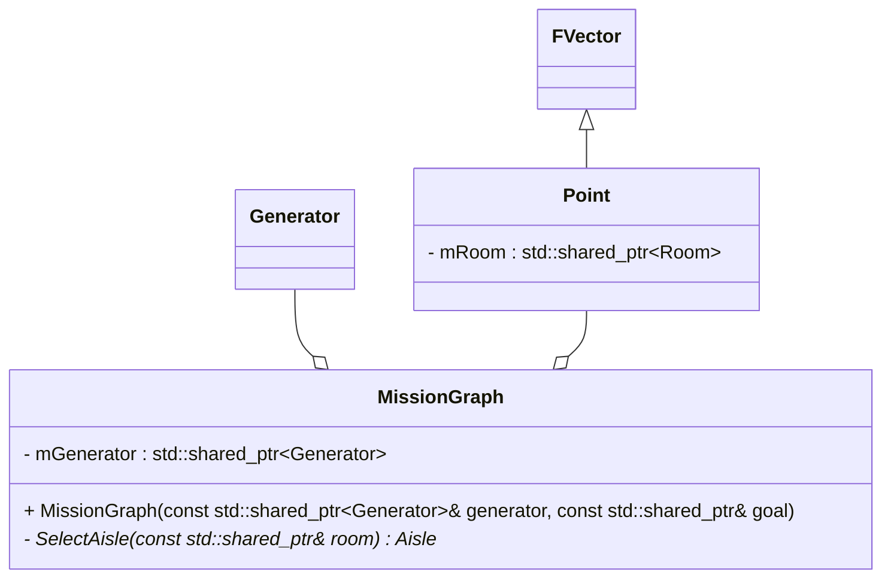
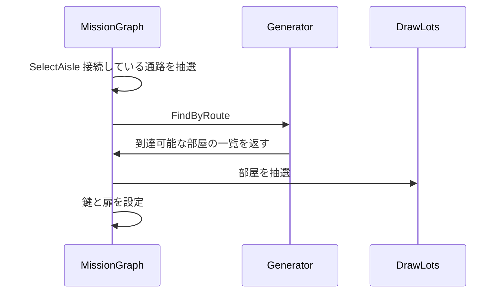

# MissionGraph

```mermaid
classDiagram

class MissionGraph {
    + MissionGraph(const std::shared_ptr~Generator~& generator, const std::shared_ptr<const Point>& goal)
	- SelectAisle(const std::shared_ptr<const Room>& room) Aisle*
    - mGenerator : std::shared_ptr~Generator~
}

class Generator {
   
}

class Point {
    - mRoom : std::shared_ptr~Room~
}

Generator --o MissionGraph
FVector <|-- Point
Point --o MissionGraph

```

```mermaid
sequenceDiagram

MissionGraph ->> MissionGraph : SelectAisle 接続している通路を抽選
MissionGraph ->> Generator : FindByRoute
Generator ->> MissionGraph : 到達可能な部屋の一覧を返す
MissionGraph ->> DrawLots : 部屋を抽選
MissionGraph ->> MissionGraph : 鍵と扉を設定
```
