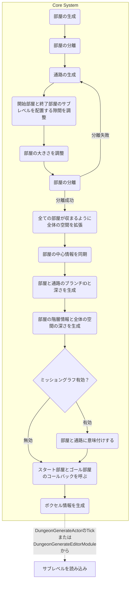

# Core

ダンジョン生成の中心機能を集めたパッケージです。
環境依存を極力抑えていますが、算術系クラスはUnrealEngineのクラスを利用しています。

`GenerateParameter`を元にしてボクセルを生成します。ボクセル内のグリッドを評価してメッシュを生成する事でダンジョンを可視化する事ができます。
ボクセルの評価やメッシュの生成はプラットフォーム依存なので、このパッケージでは取り扱っていません。

## Debug

デバッグに関するパッケージです。
ビルドの設定、ログの出力を扱っています。

## Helper

汎用的なクラスに関するパッケージです。
CRCや抽選など様々な機能を扱っています。

## Math

計算に関するパッケージです。
点、円、三角形、四面体、乱数など様々な機能を扱っています。

## MissionGraph

鍵とドアの組み合わせによるミッションを構築するパッケージです。

## PathGeneration

部屋と部屋をつなぐ経路に関するパッケージです。
ドロネー三角形分割、最小スパニングツリー、AABBなどの機能を扱っています。

## RoomGeneration

部屋と通路に関するパッケージです。

## Voxelization

ボクセルに関するパッケージです。
ノード情報からボクセル情報を生成する機能を扱っています。

# 大筋の流れ

