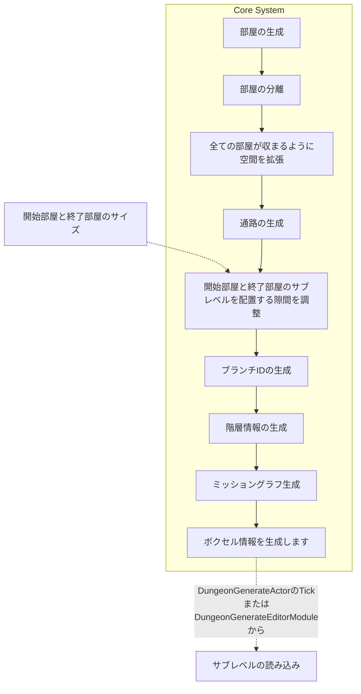
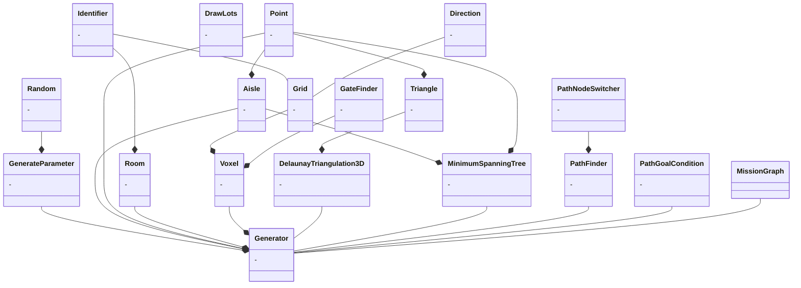
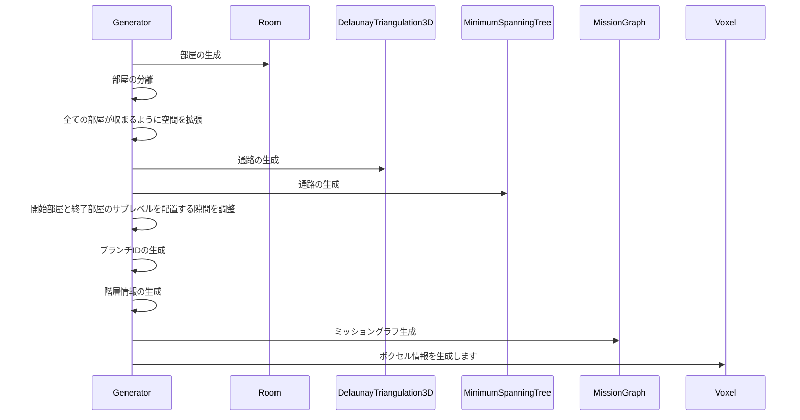

# 大筋の流れ

```mermaid
graph TD

部屋の生成 --> 部屋の分離
部屋の分離 --> 全ての部屋が収まるように空間を拡張
全ての部屋が収まるように空間を拡張 --> 通路の生成
開始部屋と終了部屋のサイズ -.-> 開始部屋と終了部屋のサブレベルを配置する隙間を調整
通路の生成 --> 開始部屋と終了部屋のサブレベルを配置する隙間を調整
開始部屋と終了部屋のサブレベルを配置する隙間を調整 --> ブランチIDの生成
ブランチIDの生成 --> 階層情報の生成
階層情報の生成 --> ミッショングラフ生成
ミッショングラフ生成 --> ボクセル情報を生成します
ボクセル情報を生成します -.->|DungeonGenerateActorのTickまたはDungeonGenerateEditorModuleから| サブレベルの読み込み

subgraph Core System
部屋の生成
部屋の分離
全ての部屋が収まるように空間を拡張
通路の生成
開始部屋と終了部屋のサブレベルを配置する隙間を調整
ブランチIDの生成
階層情報の生成
ミッショングラフ生成
ボクセル情報を生成します
end
```

# クラス図

```mermaid
classDiagram

    class Aisle {
        -
    }

    class DelaunayTriangulation3D {
        -
    }

    class Direction {
        -
    }

    class DrawLots {
        -
    }

    class GateFinder {
        -
    }

    class GenerateParameter {
        -
    }

    class Generator {
        -
    }

    class Grid {
        -
    }

    class Identifier {
        -
    }

    class MinimumSpanningTree {
        -
    }

    class PathFinder {
        -
    }

    class PathGoalCondition {
        -
    }

    class PathNodeSwitcher {
        -
    }

    class Room {

    }

    class Point {
        -
    }

    class Room {
        -
    }

    class Triangle {
        -
    }

    class Voxel {
        -
    }

    class Random {
        -
    }

Point --* Aisle
Triangle --* DelaunayTriangulation3D
Random --* GenerateParameter


GenerateParameter --* Generator
Aisle --* Generator
Point --* Generator
Room --* Generator
Voxel --* Generator
DelaunayTriangulation3D -- Generator
MinimumSpanningTree -- Generator
PathFinder -- Generator
PathGoalCondition -- Generator
MissionGraph -- Generator


Point --* Triangle


Aisle --* MinimumSpanningTree
Point --* MinimumSpanningTree
PathNodeSwitcher --* PathFinder

Identifier --* Room
Grid --* Voxel
GateFinder --* Voxel

Identifier -- Grid
Direction -- Grid
```

# シーケンス図

```mermaid
sequenceDiagram

Generator ->> Room : 部屋の生成
Generator ->> Generator : 部屋の分離
Generator ->> Generator : 全ての部屋が収まるように空間を拡張
Generator ->> DelaunayTriangulation3D : 通路の生成
Generator ->> MinimumSpanningTree : 通路の生成
Generator ->> Generator : 開始部屋と終了部屋のサブレベルを配置する隙間を調整
Generator ->> Generator : ブランチIDの生成
Generator ->> Generator : 階層情報の生成
Generator ->> MissionGraph : ミッショングラフ生成
Generator ->> Voxel : ボクセル情報を生成します

```