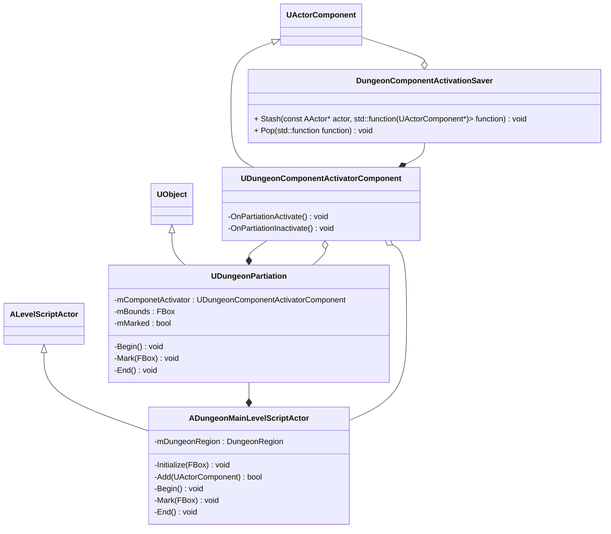
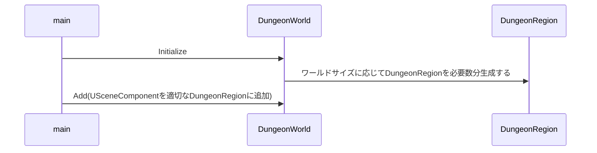
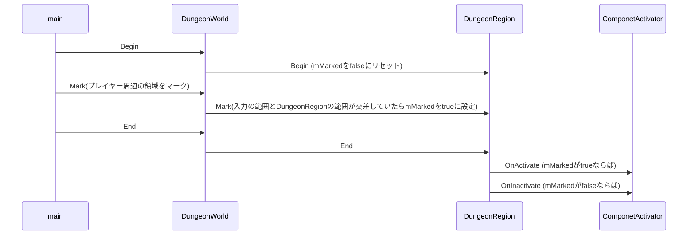

# クラス図

```mermaid
classDiagram

class DungeonComponentActivationSaver{
	+ Stash(const AActor* actor, std::function<std::pair<bool, T>(UActorComponent*)> function) void
	+ Pop(std::function<void(UActorComponent*, const T)> function) void
}

class UDungeonComponentActivatorComponent {
    -OnPartiationActivate() void
    -OnPartiationInactivate() void
}

class UDungeonPartiation {
    -mComponetActivator : UDungeonComponentActivatorComponent
    -mBounds : FBox
    -mMarked : bool

    -Begin() void
    -Mark(FBox) void
    -End() void
}

class ADungeonMainLevelScriptActor {
    -mDungeonRegion : DungeonRegion

    -Initialize(FBox) void
    -Add(UActorComponent) bool

    -Begin() void
    -Mark(FBox) void
    -End() void
}

UActorComponent --o DungeonComponentActivationSaver

UActorComponent <|-- UDungeonComponentActivatorComponent
ADungeonMainLevelScriptActor --o UDungeonComponentActivatorComponent
UDungeonPartiation --o UDungeonComponentActivatorComponent
DungeonComponentActivationSaver --* UDungeonComponentActivatorComponent

UObject <|-- UDungeonPartiation
UDungeonComponentActivatorComponent --* UDungeonPartiation

ALevelScriptActor <|-- ADungeonMainLevelScriptActor
UDungeonPartiation --* ADungeonMainLevelScriptActor
```

# 以下は更新が必要です
# 初期化シーケンス

```mermaid
sequenceDiagram
    main ->> DungeonWorld : Initialize
    DungeonWorld ->> DungeonRegion : ワールドサイズに応じてDungeonRegionを必要数分生成する
    main ->> DungeonWorld : Add(USceneComponentを適切なDungeonRegionに追加)
```

# 更新シーケンス

```mermaid
sequenceDiagram
    main ->> DungeonWorld : Begin
    DungeonWorld ->> DungeonRegion : Begin (mMarkedをfalseにリセット)

    main ->> DungeonWorld : Mark(プレイヤー周辺の領域をマーク)
    DungeonWorld ->> DungeonRegion : Mark(入力の範囲とDungeonRegionの範囲が交差していたらmMarkedをtrueに設定)

    main ->> DungeonWorld : End
    DungeonWorld ->> DungeonRegion : End
    DungeonRegion ->>ComponetActivator : OnActivate (mMarkedがtrueならば)
    DungeonRegion ->>ComponetActivator : OnInactivate (mMarkedがfalseならば)
```
