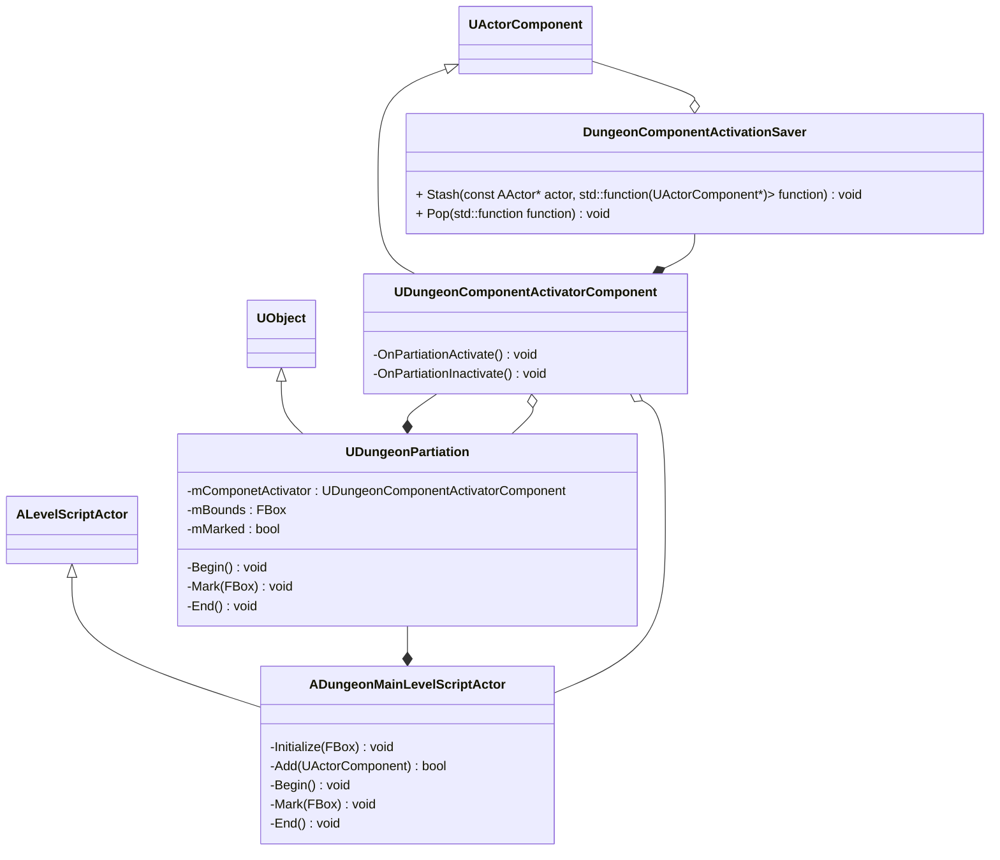
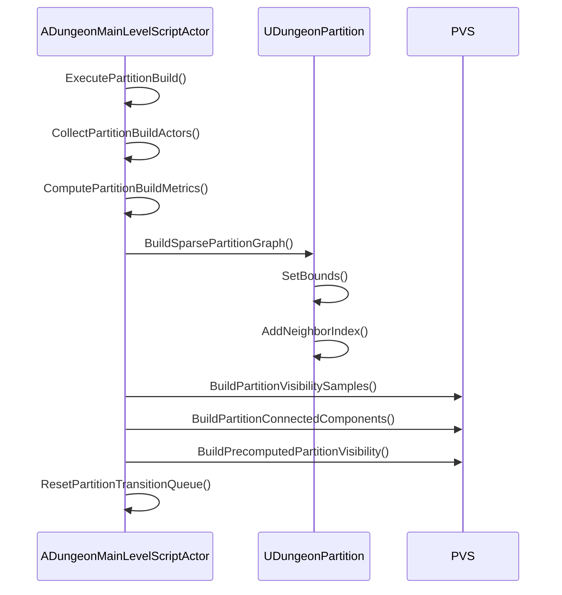
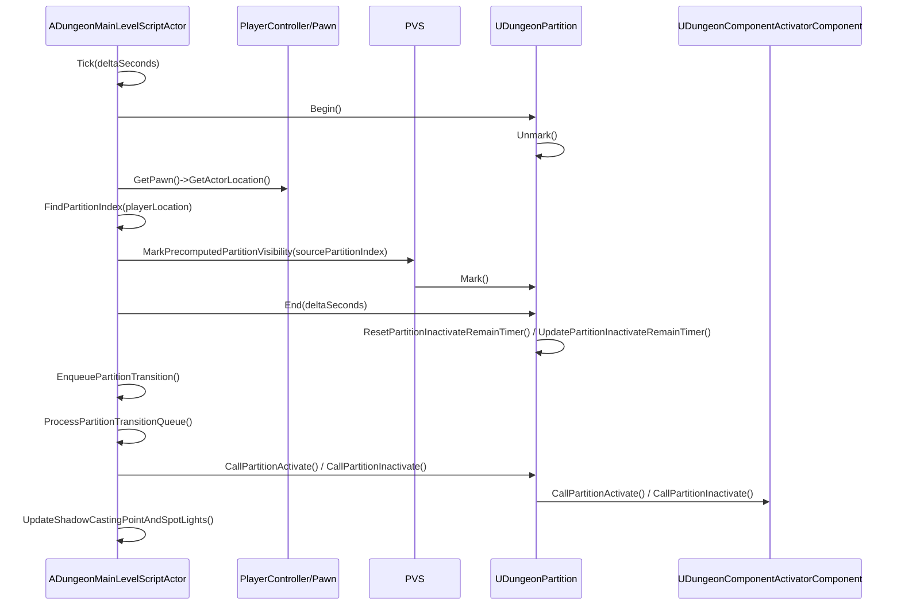
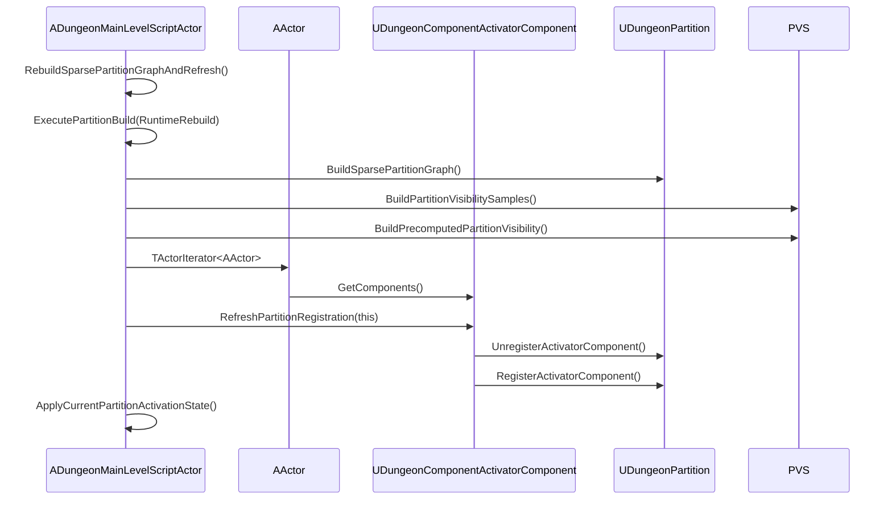

# アクターの負荷を分散

# PVS による負荷制御

PVS (Potentially Visible Set) は、生成済み dungeon の traversable grid から、各 Partition が見える可能性のある Partition 集合を事前計算する仕組みです。
Runtime では Player/Pawn の現在 Partition を起点に PVS を参照し、必要な Partition だけ `Mark()` して `UDungeonComponentActivatorComponent` を復帰します。

PVS は厳密な遮蔽判定ではなく、見えているものを消さないために保守的に広める設計です。
壁、床、天井で明確に遮られている場合は除外しますが、見える可能性が残る場合は対象 Partition を有効化側に含めます。

スロープ、吹き抜け、上下階をつなぐ空間では、床中心だけの直線判定だと上下方向の見通しを取りこぼしやすくなります。
そのため、`Slope` / `Stairwell` / `DownSpace` / `UpSpace` では入口側、出口側、上下空間を表す追加サンプルを使い、PVS を安全側に広げます。

PVS 構築に失敗した場合は、見え消えを避けるため全 Partition をアクティブに倒します。
負荷削減よりも、プレイヤーから見えているメッシュやライトを突然消さないことを優先します。

# クラス図

# パーティション構築シーケンス

`PreInitializeComponents()` または `RebuildSparsePartitionGraphAndRefresh()` から `ExecutePartitionBuild()` を呼び、現在の生成済み dungeon から runtime 用の Partition graph と PVS を作ります。

# Runtime 更新シーケンス

Play 中は `Tick()` で Player/Pawn の現在位置を調べ、PVS から必要な Partition を `Mark()` します。
`End(deltaSeconds)` で marked/unmarked を目的の activation state に変換し、非アクティブ化猶予 timer と遷移キューを処理します。

# Runtime 再構築シーケンス

生成後に traversable layout が変わった場合は `RebuildSparsePartitionGraphAndRefresh()` を呼び、Partition graph と PVS を作り直します。
再構築後は全 `UDungeonComponentActivatorComponent` を現在位置の Partition に登録し直し、現在の Player/Pawn 位置から activation state を即時同期します。

