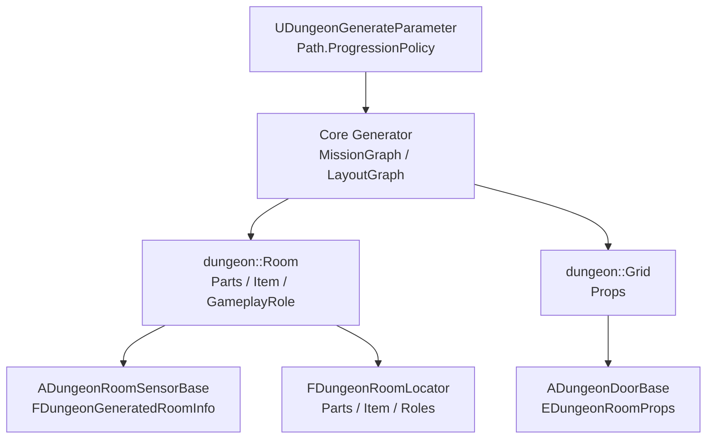

# ミッション情報

`Mission` ディレクトリは、生成済み dungeon の部屋や通路に付与される「進行上の意味」を Unreal 側へ渡すための型を定義します。ここでいう Mission は、クエスト管理 Actor のような Runtime システムではなく、Dungeon 生成時に決まる room parts、room item、door props を Blueprint や生成済み Actor から扱えるようにするための薄い変換レイヤーです。

## 主要な型

|型|対応する内部型|用途|
|-|-|-|
|`EDungeonRoomParts`|`dungeon::Room::Parts`|部屋の構造上の分類です。`Hall`、`Hanare`、`Start`、`Goal` を Unreal 側へ公開します。|
|`EDungeonRoomLocatorParts`|`dungeon::Room::Parts` の一部|SubLevel の `FDungeonRoomLocator` が使う部屋分類です。`Start` と `Goal` は locator 対象外なので含みません。|
|`EDungeonRoomItem`|`dungeon::Room::Item`|部屋に配置される進行アイテムです。`Empty`、`Key`、`UniqueKey` を表します。|
|`EDungeonRoomProps`|`dungeon::Grid::Props`|通路/ドア側に付く進行 props です。`None`、`Lock`、`UniqueLock` を表します。|

各 enum は内部生成コードの enum と順序を合わせています。`static_cast` で変換している箇所があるため、値を追加・並べ替えする場合は内部型、名前配列、変換処理を同時に更新する必要があります。

## 生成時の流れ

`UDungeonGenerateParameter` の `Path.ProgressionPolicy` が `KeysAndLocks` の場合、内部の `GenerateParameter::SetMissionGraph(true)` が呼ばれ、鍵とロックを使う進行ルートを生成します。旧 `UseMissionGraph` は v1 からの移行用で、現在は `Path.ProgressionPolicy == KeysAndLocks` と同期されます。

生成された内部 room 情報は `ADungeonGenerateBase::CreateImplement_PrepareSpawnRoomSensor()` で `FDungeonGeneratedRoomInfo` に詰め直されます。この時点で `room->GetParts()` は `EDungeonRoomParts`、`room->GetItem()` は `EDungeonRoomItem` に変換され、`RoomGameplayRole`、`RoomStructuralRole`、`BranchId`、`DepthFromStart`、`bLockedRouteRoom` などと一緒に `ADungeonRoomSensorBase` へ渡されます。

通路やドア側では、voxel grid の `Grid::Props` が `EDungeonRoomProps` に変換されます。`ADungeonGenerateBase::CreateImplement_AddDoor()` は grid props を `SpawnDoorActor()` へ渡し、`ADungeonDoorBase::InvokeInitialize()` が `Lock` / `UniqueLock` の状態を反映します。

## RoomSensor と GameplayRole

`ADungeonRoomSensorBase` は、生成済み部屋の Mission 情報を Runtime/Blueprint から参照する入口です。`Parts`、`Item`、`FDungeonGeneratedRoomInfo` を保持し、部屋内のドア登録や `HasLockedDoor()` の判定にも使われます。

`RoomGameplayRole` は `Mission` ディレクトリではなく layout/parameter 側の概念ですが、Mission 情報と一緒に RoomSensor へ渡されます。これにより、Combat、Treasure、Puzzle、Rest、Boss、Secret などの役割ごとに RoomSensor class、fixture、interior database、敵スポーン倍率を切り替えられます。

## SubLevel RoomLocator との関係

SubLevel の `FDungeonRoomLocator` は、生成済み room に対して配置可能な SubLevel を選ぶために `EDungeonRoomLocatorParts` と `EDungeonRoomItem` を使います。`Start` と `Goal` room は専用の StartRoom/GoalRoom 設定で扱うため、locator parts には含めません。

RoomLocator の判定では、room item、parts、structural role、gameplay role、サイズ条件、追加確率などが確認されます。条件に合う room だけが SubLevel 配置候補になります。

## 注意点

- `EDungeonRoomParts` と `dungeon::Room::Parts` は値順を合わせる必要があります。
- `EDungeonRoomItem` と `dungeon::Room::Item`、`EDungeonRoomProps` と `dungeon::Grid::Props` も同じ方針です。
- `KeysAndLocks` では locked door を迂回できないように、unsafe な loop や extra corridor complexity が制限されます。
- `Path.StartRoomPolicy=UseMultiStart` は `KeysAndLocks` と併用できないため、生成時に single start policy へ fallback します。

## 参考資料

* https://people.southwestern.edu/~schrum2/SCOPE/SCOPE-Poster-ZeldaGAN.pdf
* https://www.semanticscholar.org/paper/The-Zelda-Dungeon-Generator%3A-Adopting-Generative-to-Lavender/ab054224e6c43f96f06ece41f336b7a5a070a4e3

