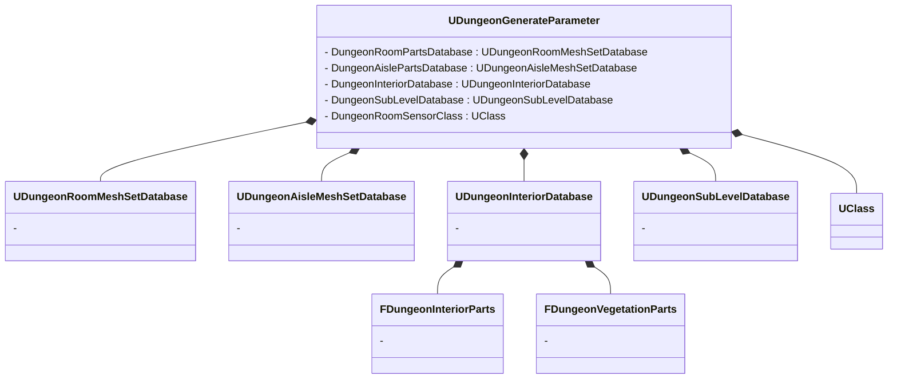

# ダンジョン生成パラメータ

```mermaid
classDiagram

class UDungeonGenerateParameter {
    - DungeonRoomPartsDatabase : UDungeonRoomMeshSetDatabase
    - DungeonAislePartsDatabase : UDungeonAisleMeshSetDatabase
    - DungeonInteriorDatabase : UDungeonInteriorDatabase
    - DungeonSubLevelDatabase : UDungeonSubLevelDatabase
    - DungeonRoomSensorClass : UClass
}

UDungeonGenerateParameter *-- UDungeonRoomMeshSetDatabase
UDungeonGenerateParameter *-- UDungeonAisleMeshSetDatabase
UDungeonGenerateParameter *-- UDungeonInteriorDatabase
UDungeonGenerateParameter *-- UDungeonSubLevelDatabase
UDungeonGenerateParameter *-- UClass

class UDungeonRoomMeshSetDatabase {
    -
}

class UDungeonAisleMeshSetDatabase {
    -
}

class UDungeonInteriorDatabase {
    -
}

UDungeonInteriorDatabase *-- FDungeonInteriorParts
UDungeonInteriorDatabase *-- FDungeonVegetationParts

class FDungeonInteriorParts {
    -
}

class FDungeonVegetationParts {
    -
}

class UDungeonSubLevelDatabase {
    -
}
```
