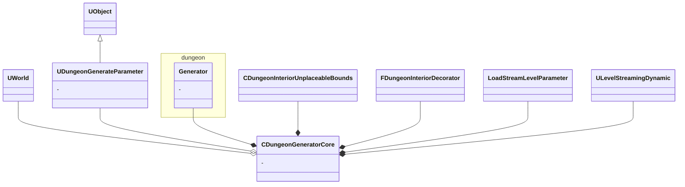
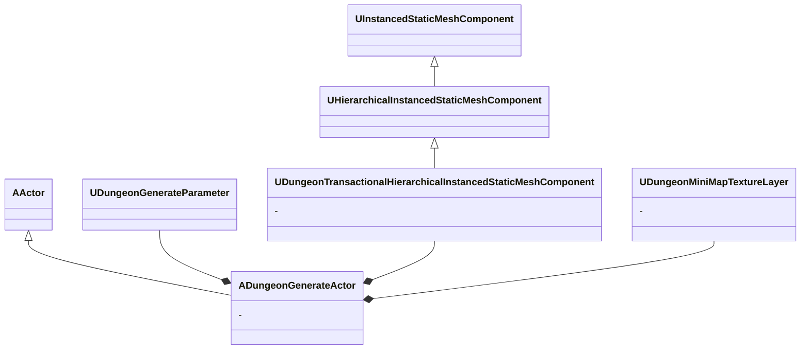
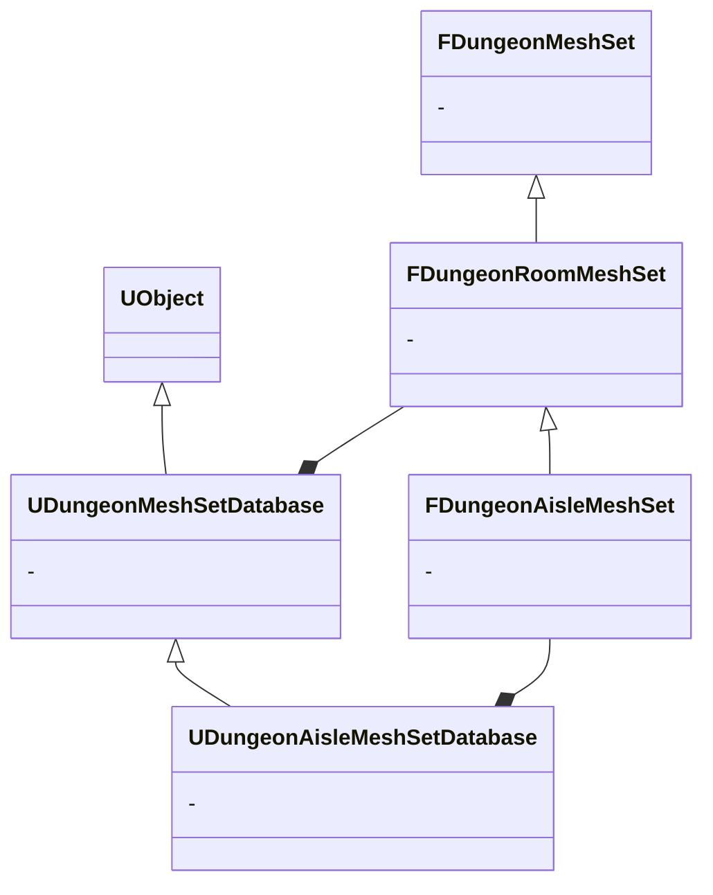
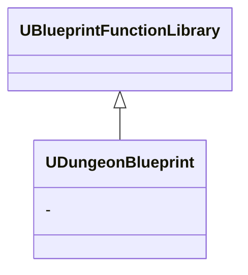

# CDungeonGeneratorCore

```mermaid
classDiagram

class UDungeonGenerateParameter {
    -
}

class CDungeonGeneratorCore {
    -
}

namespace dungeon {
    class Generator {
        -
    }
}


UObject <|-- UDungeonGenerateParameter

UWorld --o CDungeonGeneratorCore
UDungeonGenerateParameter --o CDungeonGeneratorCore
Generator --* CDungeonGeneratorCore
CDungeonInteriorUnplaceableBounds --* CDungeonGeneratorCore
FDungeonInteriorDecorator --* CDungeonGeneratorCore
LoadStreamLevelParameter --* CDungeonGeneratorCore
ULevelStreamingDynamic --* CDungeonGeneratorCore
```

# DungeonGenerateActor

```mermaid
classDiagram

class ADungeonGenerateActor {
    -
}

class UDungeonTransactionalHierarchicalInstancedStaticMeshComponent {
    -
}

class UDungeonMiniMapTextureLayer {
    -
}

AActor <|-- ADungeonGenerateActor
UDungeonGenerateParameter --* ADungeonGenerateActor
UDungeonTransactionalHierarchicalInstancedStaticMeshComponent --* ADungeonGenerateActor
UHierarchicalInstancedStaticMeshComponent <|-- UDungeonTransactionalHierarchicalInstancedStaticMeshComponent
UInstancedStaticMeshComponent <|-- UHierarchicalInstancedStaticMeshComponent
UDungeonMiniMapTextureLayer --* ADungeonGenerateActor
```

# DungeonMeshSet

```mermaid
classDiagram

class FDungeonMeshSet {
    -
}

class FDungeonRoomMeshSet {
    -
}

class FDungeonAisleMeshSet {
    -
}

class UDungeonMeshSetDatabase {
    -
}

class UDungeonAisleMeshSetDatabase {
    -
}


FDungeonMeshSet <|-- FDungeonRoomMeshSet
FDungeonRoomMeshSet <|-- FDungeonAisleMeshSet

UObject <|-- UDungeonMeshSetDatabase
UDungeonMeshSetDatabase <|-- UDungeonAisleMeshSetDatabase
FDungeonRoomMeshSet --* UDungeonMeshSetDatabase
FDungeonAisleMeshSet --* UDungeonAisleMeshSetDatabase


```

# BlueprintFunctionLibrary

```mermaid
classDiagram

class UDungeonBlueprint {
    -
}

UBlueprintFunctionLibrary <|-- UDungeonBlueprint

```