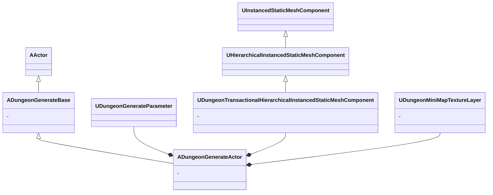
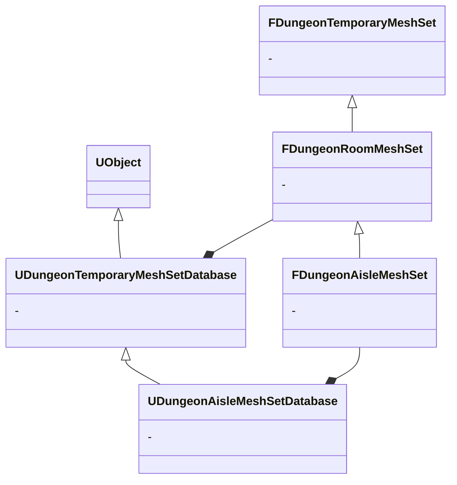
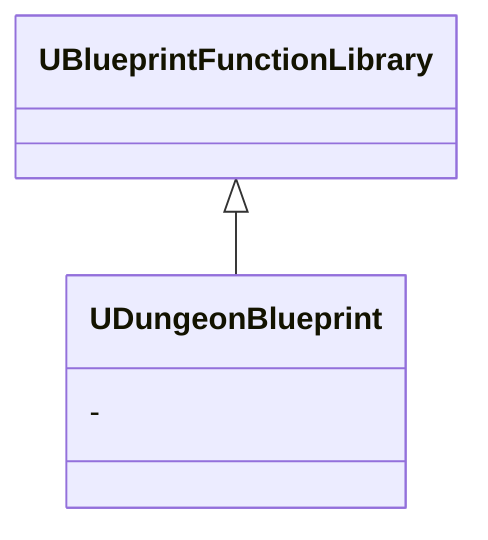
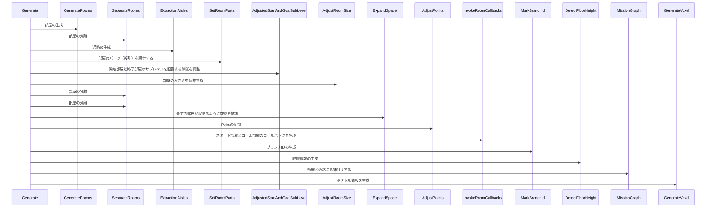
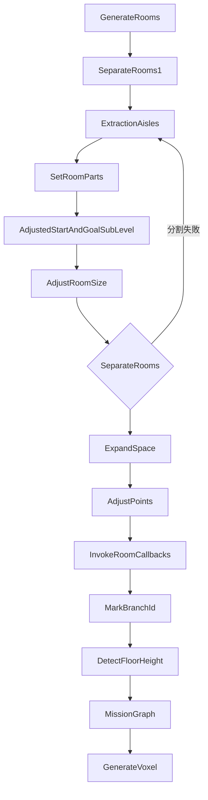

# ダンジョン生成

# CDungeonGeneratorCore

```mermaid
classDiagram

class UDungeonGenerateParameter {
    -
}

class CDungeonGeneratorCore {
    -
}

namespace dungeon {
    class Generator {
        -
    }
}


UObject <|-- UDungeonGenerateParameter

UWorld --o CDungeonGeneratorCore
UDungeonGenerateParameter --o CDungeonGeneratorCore
Generator --* CDungeonGeneratorCore
CDungeonInteriorUnplaceableBounds --* CDungeonGeneratorCore
FDungeonInteriorDecorator --* CDungeonGeneratorCore
LoadStreamLevelParameter --* CDungeonGeneratorCore
ULevelStreamingDynamic --* CDungeonGeneratorCore
```

# DungeonGenerateActor

```mermaid
classDiagram

class ADungeonGenerateBase {
    -
}

class ADungeonGenerateActor {
    -
}

class UDungeonTransactionalHierarchicalInstancedStaticMeshComponent {
    -
}

class UDungeonMiniMapTextureLayer {
    -
}

AActor <|-- ADungeonGenerateBase
ADungeonGenerateBase <|-- ADungeonGenerateActor
UDungeonGenerateParameter --* ADungeonGenerateActor
UDungeonTransactionalHierarchicalInstancedStaticMeshComponent --* ADungeonGenerateActor
UHierarchicalInstancedStaticMeshComponent <|-- UDungeonTransactionalHierarchicalInstancedStaticMeshComponent
UInstancedStaticMeshComponent <|-- UHierarchicalInstancedStaticMeshComponent
UDungeonMiniMapTextureLayer --* ADungeonGenerateActor
```

# DungeonMeshSet

```mermaid
classDiagram

class FDungeonTemporaryMeshSet {
    -
}

class FDungeonRoomMeshSet {
    -
}

class FDungeonAisleMeshSet {
    -
}

class UDungeonTemporaryMeshSetDatabase {
    -
}

class UDungeonAisleMeshSetDatabase {
    -
}


FDungeonTemporaryMeshSet <|-- FDungeonRoomMeshSet
FDungeonRoomMeshSet <|-- FDungeonAisleMeshSet

UObject <|-- UDungeonTemporaryMeshSetDatabase
UDungeonTemporaryMeshSetDatabase <|-- UDungeonAisleMeshSetDatabase
FDungeonRoomMeshSet --* UDungeonTemporaryMeshSetDatabase
FDungeonAisleMeshSet --* UDungeonAisleMeshSetDatabase


```

# BlueprintFunctionLibrary

```mermaid
classDiagram

class UDungeonBlueprint {
    -
}

UBlueprintFunctionLibrary <|-- UDungeonBlueprint

```

```mermaid
sequenceDiagram
    Generate ->> GenerateRooms : 部屋の生成
    Generate ->> SeparateRooms : 部屋の分離
    Generate ->> ExtractionAisles : 通路の生成
    Generate ->> SetRoomParts : 部屋のパーツ（役割）を設定する
    Generate ->> AdjustedStartAndGoalSubLevel : 開始部屋と終了部屋のサブレベルを配置する隙間を調整
    Generate ->> AdjustRoomSize : 部屋の大きさを調整する
    Generate ->> SeparateRooms : 部屋の分離
    Generate ->> SeparateRooms : 部屋の分離
    Generate ->> ExpandSpace : 全ての部屋が収まるように空間を拡張
    Generate ->> AdjustPoints : Pointの同期
    Generate ->> InvokeRoomCallbacks : スタート部屋とゴール部屋のコールバックを呼ぶ
    Generate ->> MarkBranchId : ブランチIDの生成
    Generate ->> DetectFloorHeight : 階層情報の生成
    Generate ->> MissionGraph : 部屋と通路に意味付けする
    Generate ->> GenerateVoxel : ボクセル情報を生成
```

```mermaid
graph TD;
GenerateRooms --> SeparateRooms1
SeparateRooms1 --> ExtractionAisles
ExtractionAisles --> SetRoomParts
SetRoomParts --> AdjustedStartAndGoalSubLevel
AdjustedStartAndGoalSubLevel --> AdjustRoomSize
AdjustRoomSize --> SeparateRooms{ SeparateRooms }
SeparateRooms --> |分割失敗| ExtractionAisles
SeparateRooms --> ExpandSpace
ExpandSpace --> AdjustPoints
AdjustPoints --> InvokeRoomCallbacks
InvokeRoomCallbacks --> MarkBranchId
MarkBranchId --> DetectFloorHeight
DetectFloorHeight --> MissionGraph
MissionGraph --> GenerateVoxel

```
